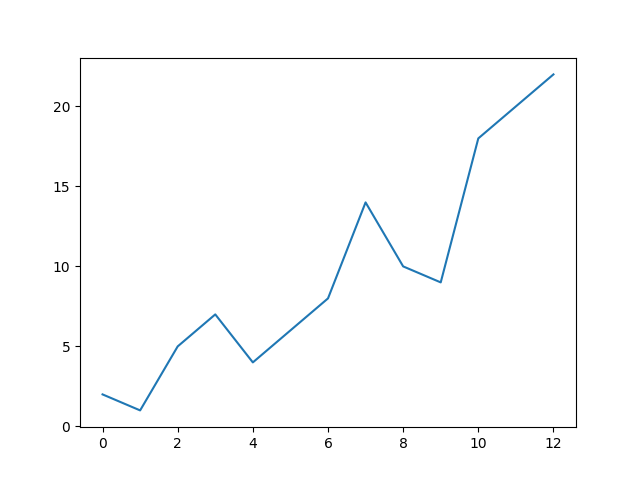
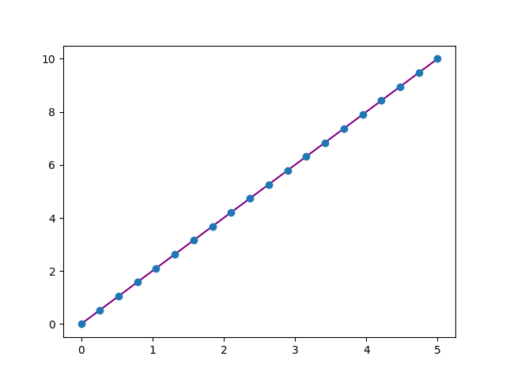
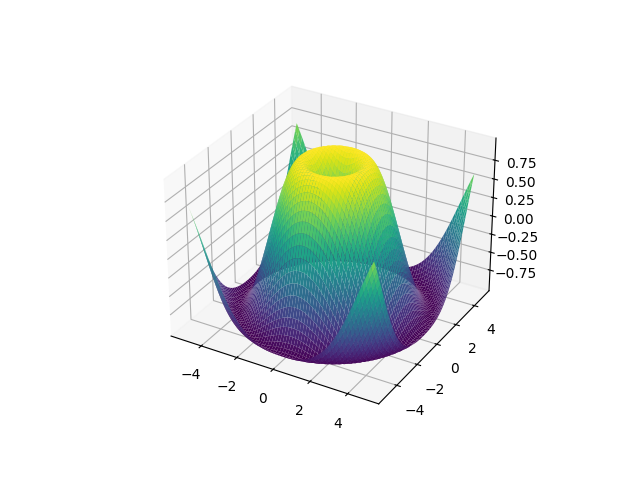

<!-- Quelle: https://github.com/numpy/numpy/blob/main/doc/source/user/absolute_beginners.rst -->

# NumPy: Grundlagen für Einsteiger

Willkommen beim deutschsprachigen Tutorial für (Total-) Einsteiger in NumPy! *Hinweis*: Dieses Tutorial ist stark an das  englischsprachige [Einsteiger-Tutorial](https://github.com/numpy/numpy/blob/main/doc/source/user/absolute_beginners.rst) auf der NumPy Homepage angelehnt.

NumPy (steht für: Numerical Python, auf Deutsch: numerisches Python) ist eine Open-Source-Python-Bibliothek, die in Wissenschaft und Technik Anwendung findet und weit verbreitet ist. Die NumPy-Bibliothek enthält mehrdimensionale Array-Datenstrukturen, wie z. B. das homogene, N-dimensionale `ndarray`, und eine große Bibliothek von Funktionen, die effizient mit diesen Datenstrukturen arbeiten.

Auf der Seite [What is NumPy?](https://numpy.org/doc/stable/user/whatisnumpy.html#whatisnumpy) kann man mehr über NumPy erfahren.

## Installation

NumPy lässt sich wie die meisten anderen Python-Module auch, via [pip](https://docs.python.org/3/installing/index.html) installieren:

```shell
pip3 install numpy
```

Wer die Python-Distribution [Anaconda](https://docs.conda.io/en/latest/) nutzt hat NumPy vielleicht schon fertig installiert auf dem System. Ansonsten kann man NumPy dort über den Paketmanager namens conda nachinstallieren:

```shell
conda install numpy
```

Weiterführende Hinweise zu weiteren Installationsmethoden findet man auf der [Installationsseite](https://numpy.org/install/) von NumPy.

## NumPy importieren

Nach erfolgreicher Installation kann man NumPy wie folgt in Python importieren:

```python
import numpy as np
```

Diese weit verbreitete Konvention, das `numpy` Modul auf `np` beim Import umzubenennen, ermöglicht den Zugriff auf NumPy-Funktionen mit einem kurzen, wiedererkennbaren Präfix (`np.`) und unterscheidet gleichzeitig NumPy-Funktionen von anderen, die den gleichen Namen tragen.

## Wie man den Beispielcode liest

In diesem Tutorial und der NumPy Dokumentation findet man immer wieder Codeblöcke wie den folgenden:

```pycon
>>> a = np.array([[1, 2, 3],
...               [4, 5, 6]])
>>> a.shape
(2, 3)
```

Text mit vorangestelltem `>>>` oder `...` ist **Eingabe**, der Code, den man in ein Skript oder an einer Python-Eingabeaufforderung eingeben würden. Alles andere ist **Ausgabe**, die Ergebnisse der Ausführung des Codes. Zu beachten ist, dass `>>>` und `...` nicht Teil des Codes sind und einen Fehler verursachen können, wenn sie an einem Python-Prompt eingegeben werden.

## Warum NumPy nutzen?

Der Python Datentyp `list` ist ein ausgezeichneter, universell einsetzbare Container. Listen können heterogen sein, d. h. sie können Elemente verschiedener Typen enthalten und sie sind recht schnell, wenn sie zur Durchführung einzelner Operationen mit einer Handvoll von Elementen verwendet werden.

Je nach den Merkmalen der Daten und der Art der auszuführenden Operationen können andere Container besser geeignet sein. Durch die Ausnutzung dieser Merkmale kann man die Geschwindigkeit erhöhen, den Speicherverbrauch verringern und eine High-Level-Syntax für die Ausführung einer Vielzahl von allgemeinen Verarbeitungsaufgaben anbieten. NumPy glänzt, wenn große Mengen homogener (gleichartiger) Daten auf der CPU verarbeitet werden müssen.

## Was ist ein "Array"?

In der Computerprogrammierung ist ein Array eine Struktur zum Speichern und Abrufen von Daten. Man spricht oft über ein Array, als wäre es ein Gitter im Raum, wobei jede Zelle ein Element der Daten speichert. Wäre beispielsweise jedes Datenelement eine Zahl, könnte man sich ein eindimensionales Array wie eine Liste vorstellen:

|   |
| - |
| 1 |
| 5 |
| 2 |

Ein zweidimensionaler Array ist wie eine Tabelle:

|   |   |   |
| - | - | - |
| 1 | 5 | 2 |
| 2 | 7 | 0 |
| 9 | 1 | 1 |

Ein dreidimensionales Array wäre wie eine Reihe von Tabellen, die vielleicht so gestapelt sind, als ob sie auf einzelnen Seiten gedruckt wären. In NumPy wird diese Idee auf eine beliebige Anzahl von Dimensionen verallgemeinert, und so heißt die grundlegende Array-Klasse `ndarray`: diese repräsentiert ein "N-dimensionales Array".

Die meisten NumPy-Arrays haben einige Einschränkungen. Zum Beispiel:

 * Alle Elemente des Arrays müssen vom gleichen Datentyp sein.
 * Nach der Erstellung darf sich die Gesamtgröße des Arrays nicht mehr ändern.
 * Die Form muss "rechteckig" sein, nicht "zackig". Z.B. muss jede Zeile eines zweidimensionalen Arrays muss die gleiche Anzahl von Spalten haben.

Wenn diese Bedingungen erfüllt sind, nutzt NumPy diese Eigenschaften aus, um das Array schneller, speichereffizienter und bequemer in der Handhabung zu machen als weniger restriktive Datenstrukturen.

Für den Rest dieses Dokuments wird das Wort "Array" verwenden, um sich auf eine Instanz von `ndarray` zu beziehen.

## Array Grundlagen

Eine Möglichkeit, ein Array zu initialisieren, ist die Verwendung einer Python-Sequenz, z. B. einer Liste. Zum Beispiel:

```pycon
>>> a = np.array([1, 2, 3, 4, 5, 6])
>>> a
array([1, 2, 3, 4, 5, 6])
```

Auf die Elemente eines Arrays kann auf verschiedene Weise zugegriffen werden. Zum Beispiel kann man auf ein einzelnes Element dieses Arrays so zugreifen, wie wir auf ein Element in der ursprünglichen Liste zugreifen würden: mit dem ganzzahligen Index des Elements in eckigen Klammern (Indexzugriff):

```pycon
>>> a[0]
1
```

Wie bei den Listen und anderen Sequenzen sind NumPy-Arrays "0-indiziert": auf das erste Element des Arrays wird mit dem Index `0` zugegriffen, nicht mit `1`.

Ebenso wie Listen sind Arrays "mutable", also veränderlich:

```pycon
>>> a[0] = 10
>>> a
array([10,  2,  3,  4,  5,  6])
```

Ebenso wird wie bei Python Listen wird Slicing unterstützt:

```pycon
>>> a[:3]
array([10, 2, 3])
```

Ein wesentlicher Unterschied besteht darin, dass bei der Slice-Indizierung einer Liste die Elemente in eine neue Liste kopiert werden, bei der Slicing-Indizierung eines Arrays jedoch eine *Ansicht* (auf Englisch: view) zurückgegeben wird: ein Objekt, das auf die Daten im ursprünglichen Array verweist. Das ursprüngliche Array kann mit Hilfe der Ansicht verändert werden.

```pycon
>>> b = a[3:]
>>> b
array([4, 5, 6])
>>> b[0] = 40
>>> a
array([ 10,  2,  3, 40,  5,  6])
```

In der NumPy Dokumentation im Kapitel [copies and views](https://numpy.org/doc/stable/user/basics.copies.html) findet man weiterführende Erklärungen, wann eine Operation mit einem Array eine Ansicht und keine Kopie zurück gibt.

Zwei- und höherdimensionale Arrays können aus verschachtelten Python-Sequenzen initialisiert werden:

```pycon
>>> a = np.array([[1, 2, 3, 4], [5, 6, 7, 8], [9, 10, 11, 12]])
>>> a
array([[ 1,  2,  3,  4],
       [ 5,  6,  7,  8],
       [ 9, 10, 11, 12]])
```

In NumPy wird eine Dimension eines Arrays manchmal als "Achse" (auf Englisch: axis) bezeichnet. Diese Terminologie kann nützlich sein, um zwischen der Dimensionalität eines Arrays und der Dimensionalität der durch das Array dargestellten Daten zu unterscheiden. Zum Beispiel könnte das Array "a" drei Punkte darstellen, die jeweils in einem vierdimensionalen Raum liegen, aber "a" hat nur zwei Achsen.

Ein weiterer Unterschied zwischen einem Array und einer Liste von Listen besteht darin, dass auf ein Element des Arrays zugegriffen werden kann, indem der Index entlang jeder Achse innerhalb eines *einzigen* Satzes von eckigen Klammern, getrennt durch Kommas, angegeben wird. Zum Beispiel befindet sich das Element `8` in Zeile `1` und Spalte `3`:

```pycon
>>> a[1, 3]
8
```

In der Mathematik ist es üblich, die Elemente einer Matrix zuerst mit dem Zeilenindex und dann mit dem Spaltenindex zu bezeichnen. Dies gilt zwar für zweidimensionale Matrizen, aber ein besseres gedankliches Modell ist es, sich den Spaltenindex als *letzten* und den Zeilenindex als *vorletzten* zu denken. Dies lässt sich auf Arrays mit einer *beliebigen* Anzahl von Dimensionen verallgemeinern.

Ein 0-D (nulldimensionales) Array wird als "Skalar" bezeichnet, ein 1-D (eindimensionales) Array als "Vektor", ein 2-D (zweidimensionales) Array als "Matrix" oder ein N-D (N-dimensionales, wobei "N" normalerweise eine ganze Zahl größer als 2 ist) Array als "Tensor". Aus Gründen der Klarheit ist es am besten, die mathematischen Begriffe zu vermeiden, wenn man sich auf ein (NumPy) Array bezieht, da sich die mathematischen Objekte mit diesen Namen anders verhalten als Arrays (z.B. unterscheidet sich die "Matrix"-Multiplikation grundlegend von der "Array"-Multiplikation), und es gibt andere Objekte im wissenschaftlichen Ökosystem von Python, die diese Namen tragen (z. B. ist die grundlegende Datenstruktur von [PyTorch](https://pytorch.org/) der "Tensor").

## Array Attribute

Dieser Abschnitt behandelt die Attribute `ndim`, `shape`, `size` und `dtype` eines Arrays.

Die Anzahl der Dimensionen eines Arrays ist in dem Attribut `ndim` enthalten.

```pycon
>>> a.ndim
2
```

Die Form (auf Englisch: shape) eines Arrays ist ein Tupel von nicht-negativen ganzen Zahlen, die die Anzahl der Elemente in jeder Dimension angeben.

```pycon
>>> a.shape
(3, 4)
>>> len(a.shape) == a.ndim
True
```

Die feste Gesamtzahl der Elemente im Array ist im Attribut `size` enthalten.

```pycon
>>> a.size
12
>>> import math
>>> a.size == math.prod(a.shape)
True
```

Arrays sind in der Regel "homogen", d.h. sie enthalten Elemente von nur einem Datentyp. Der Datentyp wird in dem Attribut `dtype` festgehalten.

```pycon
>>> a.dtype
dtype('int64')  # "int" für Integer, "64" für 64-bit
```

Mehr über `ndarrays` kann man in der NumPy Dokumentation im Kapitel [The N-dimensional array](https://numpy.org/doc/stable/reference/arrays.ndarray.html) erfahren.

## Wie ein einfacher Array angelegt wird

Diese Sektion behandelt `np.zeros()`, `np.ones()`, `np.empty()`, `np.arange()`, `np.linspace()`

Man kann nicht nur ein Array aus einer Folge von Elementen erstellen, sondern auch ein Array, das mit Nullen gefüllt ist:

```pycon
>>> np.zeros(2)
array([0., 0.])
```

Oder ein Array mit Einsen:

```pycon
>>> np.ones(2)
array([1., 1.])
```

Oder sogar ein leeres Array! Die Funktion `empty` erzeugt ein Array, dessen anfänglicher Inhalt zufällig ist und vom Zustand des Speichers abhängt. Der Grund für die Verwendung von `empty` anstelle von `zeros` (oder etwas Ähnlichem) ist die Geschwindigkeit - es muss nur sichergestellt werden, dass man anschließend jedes Element füllt!

```pycon
>>> # einen leeren Array mit zwei Elementen anlegen
>>> np.empty(2)
array([3.14, 42.  ])  # kann variieren
```

Man kann ein Array mit einem Bereich von Elementen erstellen:

```pycon
>>> np.arange(4)
array([0, 1, 2, 3])
```

Und sogar ein Array, das einen Bereich von gleichmäßig verteilten Intervallen enthält. Dazu gibt man die erste Zahl, die letzte Zahl und die Schrittweite an:

```pycon
>>> np.arange(2, 9, 2)
array([2, 4, 6, 8])
```

Man kann auch `np.linspace()` verwenden, um ein Array mit Werten zu erzeugen, die linear in einem bestimmten Intervall angeordnet sind:

```pycon
>>> np.linspace(0, 10, num=5)
array([ 0. ,  2.5,  5. ,  7.5, 10. ])
```

### Den Datentyp eines Arrays festlegen

Der Standard-Datentyp ist eine 64bit Fließkommazahl ist (`np.float64`). Man kann alternativ explizit angeben, welchen Datentyp man will, indem man das Schlüsselwort `dtype` verwenden:

```pycon
>>> x = np.ones(2, dtype=np.int64)
>>> x
array([1, 1])
```

Mehr über das Anlegen von Arrays kann man in der Dokumentation im Kapitel [Array creation](https://numpy.org/doc/stable/user/basics.creation.html) erfahren.

## Elemente hinzufügen, entfernen und sortieren

Diese Sektion behandelt `np.sort()` und `np.concatenate()`.

Das Sortieren eines Elements ist einfach mit `np.sort()`. Man kann die Achse, die Art und die Reihenfolge angeben, wenn man die Funktion aufruft.

Beginnend mit dem Array:

```pycon
>>> arr = np.array([2, 1, 5, 3, 7, 4, 6, 8])
```

kann man die Elemente wie folgt aufsteigend sortieren:

```pycon
>>> np.sort(arr)
array([1, 2, 3, 4, 5, 6, 7, 8])
```

Zusätzlich zu `sort`, was eine sortierte Kopie eines Arrays zurückgibt, kann man folgende Befehle verwenden:

 * `argsort`, eine indirekte Sortierung entlang einer bestimmten Achse
 * `lexsort`, was eine indirekte stabile Sortierung nach mehreren Schlüsseln ist
 * `searchsorted`, was Elemente in einem sortierten Array findet
 *  `partition`, was eine partielle Sortierung ist

Weitere Informationen findet man in der Dokumentation zu [sort](https://numpy.org/doc/stable/reference/generated/numpy.sort.html#numpy.sort).

Wenn man mit den folgenden Arrays startet:

```pycon
>>> a = np.array([1, 2, 3, 4])
>>> b = np.array([5, 6, 7, 8])
```

kann man diese mit `np.concatenate()` verbinden:

```pycon
>>> np.concatenate((a, b))
array([1, 2, 3, 4, 5, 6, 7, 8])
```

Oder wenn man mit diesen Arrays startet:

```pycon
  >>> x = np.array([[1, 2], [3, 4]])
  >>> y = np.array([[5, 6]])
```

kann man diese wie folgt verbinden:

```pycon
>>> np.concatenate((x, y), axis=0)
array([[1, 2],
       [3, 4],
       [5, 6]])
```

Um Elemente aus einem Array zu entfernen, kann man die Elemente, die man behalten möchte, ganz einfach mit Hilfe der Indexierung auswählen.

Mehr Informationen findet man in der Dokumentation zu [concatenate](https://numpy.org/doc/stable/reference/generated/numpy.concatenate.html#numpy.concatenate).

## Wie ermittelt man die Größe und Form eines Arrays?

Diese Sektion behandelt `ndarray.ndim`, `ndarray.size` und `ndarray.shape`.

`ndarray.ndim` gibt die Anzahl der Achsen also der Dimension, des Arrays an.

`ndarray.size` gibt die Gesamtzahl der Elemente des Arrays an. Dies ist das *Produkt* der Elemente der Form des Arrays.

`ndarray.shape` gibt ein Tupel von Ganzzahlen aus, die die Anzahl der Elemente in jeder Dimension des Arrays angeben. Wenn man zum Beispiel ein 2-D Array mit zwei Zeilen und drei Spalten hat, ist die Form des Arrays ``(2, 3)``.

Beispiel:

```pycon
>>> array_example = np.array([[[0, 1, 2, 3],
...                            [4, 5, 6, 7]],
...
...                           [[0, 1, 2, 3],
...                            [4, 5, 6, 7]],
...
...                           [[0 ,1 ,2, 3],
...                            [4, 5, 6, 7]]])
```

Um die Anzahl der Dimensionen des Arrays zu ermitteln, führt man folgenden Befehl aus:

```pycon
>>> array_example.ndim
3
```

Um die Gesamtzahl der Elemente im Array zu ermitteln, führt man folgendes aus:

```pycon
>>> array_example.size
24
```

Und um die Form zu ermitteln, dient der folgende Befehl:

```pycon
>>> array_example.shape
(3, 2, 4)
```


## Kann man die Form eines Arrays ändern?

Diese Sektion behandelt `arr.reshape()`.

Ja, man kann die Form ändern!

Mit `arr.reshape()` kann man einem Array eine neue Form geben, ohne die Daten zu verändern. Es ist daran zu denken, dass das Array, das man mit der reshape-Methode erzeugen will, die gleiche Anzahl von Elementen haben muss wie das ursprüngliche Array. Wenn man mit einem Array mit 12 Elementen beginnt, müssen man sicherstellen, dass der neue Array ebenfalls aus 12 Elementen besteht.

Beginnt man mit dem folgenden Array

```pycon
>>> a = np.arange(6)
>>> print(a)
[0 1 2 3 4 5]
```

kann man `reshape()` verwenden, um diesen Array neu zu formen. Zum Beispiel kann man folgende Umformung in einen Array mit drei Zeilen und zwei Spalten vornehmen:

```pycon
>>> b = a.reshape(3, 2)
>>> print(b)
[[0 1]
[2 3]
[4 5]]
```

Mit `np.reshape` kann man einige optionale Parameter angeben:

```pycon
>>> np.reshape(a, newshape=(1, 6), order="C")
array([[0, 1, 2, 3, 4, 5]])
```

 * `a` ist der Array, der umgeformt werden soll.
 * `newshape` ist die neue Form, die man haben möchte. Man kann eine ganze Zahl oder ein Tupel von ganzen Zahlen angeben. Wenn man eine ganze Zahl angibt, wird das Ergebnis ein Array dieser Länge sein. Die Form sollte mit der Originalform kompatibel sein.
 * `order:"C"` bedeutet, dass die Elemente in C-ähnlicher Indexreihenfolge gelesen/geschrieben werden, `F` bedeutet, dass die Elemente in Fortran-ähnlicher Indexreihenfolge gelesen/geschrieben werden, `A` bedeutet, dass die Elemente in Fortran-ähnlicher Indexreihenfolge gelesen/geschrieben werden, wenn `a` im Speicher zusammenhängend ist, ansonsten in C-ähnlicher Reihenfolge. Dies ist ein optionaler Parameter und muss nicht angegeben werden.

Wenn man mehr über die C- und Fortran-Ordnung erfahren möchten, kann man in der Dokumentation unter "NumPy internals" mehr über die interne Organisation von NumPy-Arrays lesen. Im Wesentlichen haben C- und Fortran-Reihenfolgen damit zu tun, wie die Indizes der Reihenfolge entsprechen, in der das Array im Speicher abgelegt ist. In Fortran ist der erste Index der sich am schnellsten verändernder Index, wenn man sich durch die Elemente eines zweidimensionalen Arrays bewegt, so wie es im Speicher gespeichert ist. Da der erste Index bei seiner Änderung in die nächste Zeile wechselt, wird die Matrix spaltenweise gespeichert. Aus diesem Grund wird Fortran als "Column-major language" bezeichnet. In C hingegen ändert sich der letzte Index am schnellsten. Die Matrix wird zeilenweise gespeichert, so dass es sich um eine "Row-major language" handelt. Ob man C oder Fortran wählt, hängt davon ab, ob es wichtiger ist, die Indexierungskonvention beizubehalten oder die Daten nicht umzuordnen.

Weitere Informationen sind in der Dokumentation unter [shape manipultion](https://numpy.org/doc/stable/user/quickstart.html#quickstart-shape-manipulation) zu finden.

## Einen 1D Array in einen 2D Array umwandeln - wie man neue Achsen hinzufügt

Diese Sektion behandelt `np.newaxis` und `np.expand_dims`.

Man kann `np.newaxis` und `np.expand_dims` verwenden, um die Dimensionen eines bestehenden Arrays zu vergrößern.

Die Verwendung von `np.newaxis` erhöht die Dimensionen des Arrays um eine Dimension, wenn man es einmal anwendet. Das bedeutet, dass ein 1D Array zu einem 2D Array wird, ein 2D Array wird zu einem 3D Array, und so weiter.

Wenn man mit dem folgenden Array beginnt

```pycon
>>> a = np.array([1, 2, 3, 4, 5, 6])
>>> a.shape
(6,)
```

kann man mit `np.newaxis` eine neue Achse hinzufügen:

```pycon
>>> a2 = a[np.newaxis, :]
>>> a2.shape
(1, 6)
```

Man kann ein 1D-Array explizit in einen Zeilen- oder Spaltenvektor umwandeln, indem man `np.newaxis` verwenden. Zum Beispiel kann man ein 1D-Array in einen Zeilenvektor umwandeln, indem man eine Achse entlang der ersten Dimension einfügt:

```pycon
>>> row_vector = a[np.newaxis, :]
>>> row_vector.shape
(1, 6)
```

Bei einem Spaltenvektor kann man auch eine Achse entlang der zweiten Dimension einfügen:

```pycon
>>> col_vector = a[:, np.newaxis]
>>> col_vector.shape
(6, 1)
```

Man kann ein Array auch erweitern, indem man eine neue Achse an einer bestimmten Position mit `np.expand_dims` einfügt. Zum Beispiel:

```pycon
>>> a = np.array([1, 2, 3, 4, 5, 6])
>>> a.shape
(6,)
```

Man kann `np.expand_dims` verwenden, um eine Achse an der Indexposition 1 hinzuzufügen mit:

```pycon
>>> b = np.expand_dims(a, axis=1)
>>> b.shape
(6, 1)
```

Man kann eine Achse wie folgt an der Indexposition 0 hinzufügen:

```pycon
>>> c = np.expand_dims(a, axis=0)
>>> c.shape
(1, 6)
```

Weitere Informationen findet man in der Dokumentation für [newaxis](https://numpy.org/doc/stable/reference/arrays.indexing.html) bzw. [expand_dims](https://numpy.org/doc/stable/reference/generated/numpy.expand_dims.html).

## Indizierung und Slicing

Man kann NumPy-Arrays auf die gleiche Weise indizieren und aufteilen wie Python Listen:

```pycon
>>> data = np.array([1, 2, 3])
>>> data[1]
2
>>> data[0:2]
array([1, 2])
>>> data[1:]
array([2, 3])
>>> data[-2:]
array([2, 3])
```

Vielleicht möchte man einen Teil des Arrays oder bestimmte Arrayelemente für weitere Analysen oder zusätzliche Operationen verwenden. Dazu muss man die Arrays unterteilen, zerschneiden und/oder indizieren.

Wenn man Werte aus Ihrem Array auswählen möchte, die bestimmte Bedingungen erfüllen, ist das mit NumPy ganz einfach. Zum Beispiel mit folgendem Array:

```pycon
>>> a = np.array([[1 , 2, 3, 4], [5, 6, 7, 8], [9, 10, 11, 12]])
```

Um alle Elemente im Array kleiner 5 auszugeben:

```pycon
>>> print(a[a < 5])
[1 2 3 4]
```

Man kann auch z.B. Zahlen auswählen, die gleich oder größer als 5 sind, und diese Bedingung verwenden, um ein Array zu indizieren:

```pycon
>>> five_up = (a >= 5)
>>> print(a[five_up])
[ 5  6  7  8  9 10 11 12]
```

Man kann Elemente auswählen, die durch 2 teilbar sind:

```pycon
>>> divisible_by_2 = a[a%2==0]
>>> print(divisible_by_2)
[ 2  4  6  8 10 12]
```

Man kann Elemente auswählen, die mehrere Bedingungen erfüllen und mit dem `&` (logisches und) oder `|` (logisches oder) Operator verknüpft sind:

```pycon
>>> c = a[(a > 2) & (a < 11)]
>>> print(c)
[ 3  4  5  6  7  8  9 10]
```

Man kann auch die logischen Operatoren `&` und `|` verwenden, um boolesche Werte zurückzugeben, die angeben, ob die Werte in einem Array eine bestimmte Bedingung erfüllen oder nicht. Dies kann bei Arrays nützlich sein, die Namen oder andere kategorische Werte enthalten:

```pycon
>>> five_up = (a > 5) | (a == 5)
>>> print(five_up)
[[False False False False]
 [ True  True  True  True]
 [ True  True  True True]]
```

Man kann auch `np.nonzero()` verwenden, um Elemente oder Indizes aus einem Array auszuwählen. Beginnend mit dem folgenden Array:

```pycon
>>> a = np.array([[1, 2, 3, 4], [5, 6, 7, 8], [9, 10, 11, 12]])
```

kann man `np.nonzero()` verwenden, um die Indizes von Elementen auszugeben, die z.B. kleiner als 5 sind::

```pycon
>>> b = np.nonzero(a < 5)
>>> print(b)
(array([0, 0, 0, 0]), array([0, 1, 2, 3]))
```

In diesem Beispiel wurde ein Tupel von Arrays zurückgegeben: eines für jede Dimension. Das erste Array steht für die Zeilenindizes, in denen diese Werte gefunden werden, und das zweite Array für die Spaltenindizes, in denen die Werte gefunden werden.

Wenn man eine Liste von Koordinaten erzeugen will, in der die Elemente vorhanden sind, kann man die Arrays zippen, über die Liste der Koordinaten iterieren und sie ausgeben. Zum Beispiel:

```pycon
>>> list_of_coordinates= list(zip(b[0], b[1]))
>>> for coord in list_of_coordinates:
...     print(coord)
(np.int64(0), np.int64(0))
(np.int64(0), np.int64(1))
(np.int64(0), np.int64(2))
(np.int64(0), np.int64(3))
```

Man kann auch `np.nonzero()` verwenden, um die Elemente in einem Array, die kleiner als 5 sind, mit auszugeben:

```pycon
>>> print(a[b])
[1 2 3 4]
```

Wenn das gesuchte Element im Array nicht vorhanden ist, ist das zurückgegebene Array der Indizes leer. Zum Beispiel:

```pycon
>>> not_there = np.nonzero(a == 42)
>>> print(not_there)
(array([], dtype=int64), array([], dtype=int64))
```

Weitere Information sind in der Dokumentation unter [Indexing, slicing and iterating](https://numpy.org/doc/stable/user/quickstart.html#indexing-slicing-and-iterating) sowie unter[Indexing](https://numpy.org/doc/stable/user/basics.indexing.html) zu finden.

## Einen Array aus existierenden Daten erstellen

Diese Sektion behandelt `slicing and indexing`, `np.vstack()`, `np.hstack()`, `np.hsplit()`, `.view()` und `copy()`.

Man kann ganz einfach ein neues Array aus einem Abschnitt eines bestehenden Arrays erstellen. Angenommen, man hat dieses Array:

```pycon
>>> a = np.array([1,  2,  3,  4,  5,  6,  7,  8,  9, 10])
```

Man kann jederzeit ein neues Array aus einem Abschnitt des Arrays erstellen, indem man angibt, wo man den Array aufteilen möchte:

```pycon
>>> arr1 = a[3:8]
>>> arr1
array([4, 5, 6, 7, 8])
```

Hier hat man einen Abschnitt des Arrays von Indexposition 3 bis Indexposition 8 gegriffen.

Man kann auch zwei bestehende Arrays stapeln, sowohl vertikal als auch horizontal. Angenommen, man hat zwei Arrays, `a1` und `a2`:

```pycon
>>> a1 = np.array([[1, 1],
...                [2, 2]])
>>> a2 = np.array([[3, 3],
...                [4, 4]])
```

Man kann sie mit `vstack` vertikal stapeln:

```pycon
>>> np.vstack((a1, a2))
array([[1, 1],
       [2, 2],
       [3, 3],
       [4, 4]])
```

oder horizontal mit `hstack`:

```pycon
>>> np.hstack((a1, a2))
array([[1, 1, 3, 3],
       [2, 2, 4, 4]])
```

Mit `hsplit` kann man ein Array in mehrere kleinere Arrays aufteilen. Man kann entweder die Anzahl der gleichförmigen Arrays angeben, die zurückgegeben werden sollen, oder die Spalten, nach denen die Teilung erfolgen soll:

Wenn man diesen Array hat:

```pycon
>>> x = np.arange(1, 25).reshape(2, 12)
>>> x
array([[ 1,  2,  3,  4,  5,  6,  7,  8,  9, 10, 11, 12],
       [13, 14, 15, 16, 17, 18, 19, 20, 21, 22, 23, 24]])
```

Wenn man dieses Array in drei gleich große Arrays aufteilen wollte, würde man Folgendes ausführen:

```pycon
>>> np.hsplit(x, 3)
[array([[ 1,  2,  3,  4],
        [13, 14, 15, 16]]), array([[ 5,  6,  7,  8],
        [17, 18, 19, 20]]), array([[ 9, 10, 11, 12],
        [21, 22, 23, 24]])]
```

Wenn man den Array nach der dritten und vierten Spalte aufteilen wollte, würde man Folgendes ausführen:

```pycon
>>> np.hsplit(x, (3, 4))
[array([[ 1,  2,  3],
        [13, 14, 15]]), array([[ 4],
        [16]]), array([[ 5,  6,  7,  8,  9, 10, 11, 12],
        [17, 18, 19, 20, 21, 22, 23, 24]])]
```

Mehr Informationen gibt es in der Dokumentation unter [Stacking Arrays](https://numpy.org/doc/stable/user/quickstart.html#stacking-together-different-arrays).

Man kann die Methode `view` verwenden, um ein neues Array-Objekt zu erzeugen, das die gleichen Daten wie das ursprüngliche Array enthält (eine "shallow copy", auf Deutsch: flache Kopie).

Views (auf Deutsch: Ansichten) sind ein wichtiges NumPy-Konzept. NumPy-Funktionen sowie Operationen wie Indizierung und Slicing geben, wann immer möglich, Views zurück. Das spart Speicher und ist schneller (es muss keine Kopie der Daten erstellt werden). Es ist jedoch wichtig, sich dessen bewusst zu sein - die Änderung von Daten in einer Ansicht verändert auch das ursprüngliche Array!

Wenn man ein Array wie das folgende hat:

```pycon
>>> a = np.array([[1, 2, 3, 4], [5, 6, 7, 8], [9, 10, 11, 12]])
```

Jetzt erzeugt man ein Array `b1`, indem man `a` zerschneidet und das erste Element von `b1` verändert. Dies wird auch das entsprechende Element in `a` verändern!

```pycon
>>> b1 = a[0, :]
>>> b1
array([1, 2, 3, 4])
>>> b1[0] = 99
>>> b1
array([99,  2,  3,  4])
>>> a
array([[99,  2,  3,  4],
       [ 5,  6,  7,  8],
       [ 9, 10, 11, 12]])
```

Mit der Methode `copy` wird eine vollständige Kopie des Arrays und seiner Daten erstellt ("deep copy", auf Deutsch: tiefe Kopie). Um dies für ein Array zu verwenden, könnte man folgendes ausführen:

```
>>> b2 = a.copy()
```

Weitere Informationen sind in der Dokumentation unter [Copies and Views](https://numpy.org/doc/stable/user/quickstart.html#copies-and-views) zu finden.

## Grundlegende mathematische Operationen mit Arrays

Diese Sektion behandelt Addition, Subtraktion, Multiplikation, Division und mehr.

Angenommen, man hat zwei Arrays namens `data` und `ones`:

```pycon
>>> data = np.array([1, 2])
>>> ones = np.ones(2, dtype=int)
>>> ones
array([1, 1])
```

Diese kann man jetzt beispielsweise addieren:

```pycon
>>> data + ones
array([2, 3])
```

Die Werte werden als zeilenweise addiert, wie im Folgenden schematisch dargestellt:

```
 data   ones   Ergebnis
   1      1       2
      +      =
   2      1       3
```

Natürlich kann man andere Rechenoperationen durchführen:

```pycon
>>> data - ones
array([0, 1])
>>> data * data
array([1, 4])
>>> data / data
array([1., 1.])
```

Grundlegende Operationen sind mit NumPy einfach. Wenn man die Summe der Elemente in einem Array finden möchte, verwendet man `sum()`. Dies funktioniert für 1D-Arrays, 2D-Arrays und Arrays in höheren Dimensionen:

```pycon
>>> a = np.array([1, 2, 3, 4])
>>> a.sum()
10
```

Um die Zeilen oder Spalten in einem 2D-Array hinzuzufügen, muss man die Achse angeben. Ausgehend von dem folgenden Array:

```pycon
>>> b = np.array([[1, 1], [2, 2]])
```

kann man die Summe über die Zeilen wie folgt bilden:

```pycon
>>> b.sum(axis=0)
array([3, 3])
```

Zum Aufsummieren der Spalten führt man folgendes aus:

```pycon
>>> b.sum(axis=1)
array([2, 4])
```

Mehr Informationen findet man in der Dokumentation zu [Basic operations](https://numpy.org/doc/stable/user/quickstart.html#basic-operations)

## Broadcasting

Es kann vorkommen, dass man eine Operation zwischen einem Array und einer einzelnen Zahl (auch Operation zwischen einem Vektor und einem Skalar genannt) oder zwischen Arrays zweier unterschiedlicher Größen durchführen möchte. Der Array (im Folgenden `data` genannt) könnte zum Beispiel Informationen über die Entfernung in Meilen enthalten, aber man möchte die Informationen in Kilometer umrechnen. Man kann diese Operation wie folgt durchführen:

```pycon
>>> data = np.array([1.0, 2.0])
>>> data * 1.6
array([1.6, 3.2])
```

Was NumPy hier macht ist im folgenden Schema dargestellt:

```
 data
 1.0           1.0   1.6   1.6
      * 1.6 =      *     =
 2.0           2.0   1.6   3.2
```

NumPy versteht, dass die Multiplikation mit jeder Zelle erfolgen soll. Dieses Konzept wird *Broadcasting* genannt. Broadcasting ist ein Mechanismus, der es NumPy ermöglicht, Operationen auf Arrays mit unterschiedlichen Formen durchzuführen. Die Dimensionen des Arrays müssen kompatibel sein, z.B. wenn die Dimensionen beider Arrays gleich sind oder wenn eines von ihnen 1 ist. Wenn die Dimensionen nicht kompatibel sind, erhält man einen `ValueError`.

Mehr Informationen sind in der Dokumentation unter [Broadcasting](https://numpy.org/doc/stable/user/basics.broadcasting.html#basics-broadcasting) zu finden.

## Mehr nützliche Array Operation

In dieser Sektion werden Maximum, Minimum, sum, mean, product, standard deviation und mehr behandelt.

NumPy verfügt auch über Aggregationsfunktionen. Zusätzlich zu `min`, `max` und `sum` kann man einfach `mean` ausführen, um den Durchschnitt zu erhalten, `prod`, um das Ergebnis der Multiplikation der Elemente miteinander zu erhalten, `std`, um die Standardabweichung zu erhalten, und noch viel mehr:

```pycon
>>> data.max()
2.0
>>> data.min()
1.0
>>> data.sum()
3.0
```


Gegeben sei ein Array namens `a`:

```pycon
>>> a = np.array([[0.45053314, 0.17296777, 0.34376245, 0.5510652],
...               [0.54627315, 0.05093587, 0.40067661, 0.55645993],
...               [0.12697628, 0.82485143, 0.26590556, 0.56917101]])
```

Es kommt sehr häufig vor, dass man entlang einer Zeile oder Spalte aggregieren möchte. Standardmäßig gibt jede NumPy-Aggregationsfunktion den Gesamtwert des gesamten Arrays zurück. Um die Summe oder das Minimum der Elemente in Ihrem Array zu finden, führt man folgendes aus:

```pycon
>>> a.sum()
4.8595784
>>> a.min()
0.05093587
```

Man kann angeben, auf welcher Achse die Aggregationsfunktion berechnet werden soll. Man kann zum Beispiel den Mindestwert innerhalb jeder Spalte ermitteln, indem man `axis=0` angibt:

```pycon
>>> a.min(axis=0)
array([0.12697628, 0.05093587, 0.26590556, 0.5510652 ])
```

Die vier oben aufgeführten Werte entsprechen der Anzahl der Spalten in dem Array. Bei einem vierspaltigen Array erhält man vier Werte als Ergebnis.

In der Dokumentation findet man weitere Informationen zu [Array Methoden](https://numpy.org/doc/stable/reference/arrays.ndarray.html#array-methods)

## Ein Matrix kreieren

Man kann Python Listen von Listen übergeben, um ein 2-D-Array (oder eine "Matrix") zu erstellen, um sie in NumPy darzustellen:

```pycon
>>> data = np.array([[1, 2], [3, 4], [5, 6]])
>>> data
array([[1, 2],
       [3, 4],
       [5, 6]])
```

Dies ergibt eine 2-spaltige Matrix mit drei Zeilen:

|   |   |
| - | - |
| 1 | 2 |
| 3 | 4 |
| 5 | 6 |

Indizierungs- und Aufteilungsoperationen sind bei der Bearbeitung von Matrizen nützlich. Die funktioniert wie in Python üblich, d.h. wenn man einen Bereich wie `[1:3]` angibt ist der Startwert inklusive, der Endwert exklusive:

```pycon
>>> data[0, 1]   # erste Zeile, zweites Element
2
>>> data[1:3]   # zweite bis dritte Zeile
array([[3, 4],
       [5, 6]])
>>> data[0:2, 0]   # erste und zweite Zeile der ersten Spalte
array([1, 3])
```

Man kann Matrizen auf die gleiche Weise aggregieren wie Vektoren:

```
>>> data.max()
6
>>> data.min()
1
>>> data.sum()
21
```

Man kann alle Werte in einer Matrix aggregieren, und man kann sie über Spalten oder Zeilen aggregieren, indem man den Parameter `axis` verwenden. Um dies zu veranschaulichen das folgende Beispiel:


```pycon
>>> data = np.array([[1, 2], [5, 3], [4, 6]])
>>> data
array([[1, 2],
       [5, 3],
       [4, 6]])
>>> data.max(axis=0)   # Max-Wert entlang von Spalten
array([5, 6])   # 5 ist der Max-Wert der ersten Spalte, 6 der Max-Wert der 2. Spalte
>>> data.max(axis=1)   # Max-Wert entlang von Zeilen
array([2, 5, 6])   # 2 ist der Max-Wert der ersten, 5 der zweiten und 6 der dritten Zeile
```

Wenn man seine Matrizen erstellt haben, kann man sie mit arithmetischen Operatoren addieren und multiplizieren - sofern zwei Matrizen die gleiche Größe haben. Im Folgenden ein Beispiel für eine Addition, es wird, wie bei Matrizen üblichen, zellenweise addiert:

```pycon
>>> data = np.array([[1, 2], [3, 4]])
>>> ones = np.array([[1, 1], [1, 1]])
>>> data + ones
array([[2, 3],
       [4, 5]])
```

Mann diese arithmetischen Operationen auch mit Matrizen unterschiedlicher Größe durchführen, aber nur, wenn eine Matrix nur eine Spalte oder eine Zeile hat. In diesem Fall verwendet NumPy das weiter oben bereits erwähnte Broadcasting für die Operation:

```pycon
>>> data = np.array([[1, 2], [3, 4], [5, 6]])
>>> ones_row = np.array([[1, 1]])
>>> data + ones_row
array([[2, 3],
       [4, 5],
       [6, 7]])
```


Zu beachten ist, dass, wenn NumPy N-dimensionale Arrays ausgibt, die letzte Achse am schnellsten durchlaufen wird, während die erste Achse am langsamsten ist. Zum Beispiel:

```pycon
>> np.ones((4, 3, 2))
array([[[1., 1.],
        [1., 1.],
        [1., 1.]],

        [[1., 1.],
         [1., 1.],
         [1., 1.]],

        [[1., 1.],
         [1., 1.],
         [1., 1.]],

        [[1., 1.],
         [1., 1.],
         [1., 1.]]])
```

Es gibt oft Fälle, in denen man möchte, dass NumPy die Werte eines Arrays initialisiert. NumPy bietet dafür Funktionen wie `ones()` und `zeros()`, und die Klasse `random.Generator` zur Erzeugung von Zufallszahlen. Alles, was man tun muss, ist, die Anzahl der Elemente, die generiert werden sollen, zu übergeben:

```pycon
>>> np.ones(3)
array([1., 1., 1.])
>>> np.zeros(3)
array([0., 0., 0.])
>>> rng = np.random.default_rng()  # der einfachste Weg für Zufallszahlen
>>> rng.random(3
array([0.63696169, 0.26978671, 0.04097352])
```

Dies funktioniert auch mit 2D Arrays. Dazu muss man den Methoden ein Tupel mit der gewünschten Anzahl von Zeilen und Spalten übergeben:

```pycon
>>> np.ones((3, 2))
array([[1., 1.],
       [1., 1.],
       [1., 1.]])
>>> np.zeros((3, 2))
array([[0., 0.],
       [0., 0.],
       [0., 0.]])
>>> rng.random((3, 2))
array([[0.01652764, 0.81327024],
       [0.91275558, 0.60663578],
       [0.72949656, 0.54362499]])   # Ausgabe variiert je nach generierten Zufallszahlen
```

Mehr Informationen zum Kreieren von Arrays findet man in der Dokumentation im Kapitel [Array creation routines](https://numpy.org/doc/stable/reference/routines.array-creation.html#routines-array-creation).

## Zufallszahlen generieren

Die Erzeugung von Zufallszahlen ist ein wichtiger Bestandteil der Konfiguration und Bewertung vieler numerischer und maschineller Lernalgorithmen. Ganz gleich, ob man Gewichte in einem künstlichen neuronalen Netz zufällig initialisieren, Daten in zufällige Mengen aufteilen oder einen Datensatz zufällig mischen muss, die Möglichkeit, Zufallszahlen (eigentlich wiederholbare Pseudozufallszahlen) zu erzeugen, ist unerlässlich.

Mit `Generator.integers` kann man zufällige ganze Zahlen erzeugen, innerhalb der vorgegebenen Unter- und Obergrenze. Wie bei der Python Funktion `range()` ist die Obergrenze nicht inklusive. Möchte man das, muss man das Argument `endpoint=True`` setzen, um die Obergrenze inklusiv zu machen.

Man kann ein 2 x 4 Array von zufälligen ganzen Zahlen zwischen 0 und 4 erzeugen mit:

```pycon
>>> rng.integers(5, size=(2, 4))
array([[2, 1, 1, 0],
       [0, 0, 0, 4]])  # kann variieren
```

Mehr über Zufallszahlen ist im Kapitel [Random sampling](https://numpy.org/doc/stable/reference/random/index.html#numpyrandom) der Dokumentation zu finden.

## Wie man einmalige Werte und Zählungen erhält

Dieser Abschnitt behandelt `np.unique()`.

Man kann die einmaligen Elemente in einem Array leicht mit `np.unique`` finden. Zum Beispiel in diesem Array

```pycon
>>> a = np.array([11, 11, 12, 13, 14, 15, 16, 17, 12, 13, 11, 14, 18, 19, 20])
```

über

```pycon
>>> unique_values = np.unique(a)
>>> print(unique_values)
[11 12 13 14 15 16 17 18 19 20]
```

Um die Indizes der einmaligen Werte in einem NumPy-Array zu erhalten (ein Array der ersten Indexpositionen der einmaligen Werte im Array), übergibt man einfach das Argument `return_index` in `np.unique()` sowie den Array:

```
>>> unique_values, indices_list = np.unique(a, return_index=True)
>>> print(indices_list)
[ 0  2  3  4  5  6  7 12 13 14]
```

Man kann das Argument `return_counts` in `np.unique()` zusammen mit dem Array übergeben, um die Anzahl der eindeutigen Werte in einem NumPy-Array zu erhalten:

```pycon
>>> unique_values, occurrence_count = np.unique(a, return_counts=True)
>>> print(occurrence_count)
[3 2 2 2 1 1 1 1 1 1]
```

Das funktioniert auch mit 2D Arrays:

```pycon
>>> a_2d = np.array([[1, 2, 3, 4], [5, 6, 7, 8], [9, 10, 11, 12], [1, 2, 3, 4]])
>>> unique_values = np.unique(a_2d)
>>> print(unique_values)
[ 1  2  3  4  5  6  7  8  9 10 11 12]
```

Wird das Argument `axis` nicht angegeben, dann wird der 2D Array "platt gemacht" (auf English: "flattend"), d.h. in einen 1D Array umgewandelt, in dem alle Werte einfach nacheinander stehen - wie im obigen Bespiel.

Wenn man die einmaligen Zeilen oder Spalten erhalten will, muss man das Argument `axis` übergeben. Um die eindeutigen Zeilen zu finden, gibt man `axis=0` an und für Spalten gibt man `axis=1` an:

```pycon
>>> unique_rows = np.unique(a_2d, axis=0)
>>> print(unique_rows)
[[ 1  2  3  4]
 [ 5  6  7  8]
 [ 9 10 11 12]]
```

Um die einmaligen Zeilen, die Indexposition und die Anzahl der Vorkommnisse zu erhalten, kann man Folgendes verwenden:

```pycon
>>> unique_rows, indices, occurrence_count = np.unique(
...      a_2d, axis=0, return_counts=True, return_index=True)
>>> print(unique_rows)
[[ 1  2  3  4]
 [ 5  6  7  8]
 [ 9 10 11 12]]
>>> print(indices)
[0 1 2]
>>> print(occurrence_count)
[2 1 1]
```

Mehr Informationen zu `unique` sind [in der Dokumentation](https://numpy.org/doc/stable/reference/generated/numpy.unique.html#numpy.unique) zu finden.

## Eine Matrix Transponieren und Umformen

Diese Sektion behandelt `arr.reshape()`, `arr.transpose()` und `arr.T`.

Es kommt häufig vor, dass man Matrizen transponieren muss. NumPy-Arrays haben die Eigenschaft `T`, mit der man eine Matrix transponieren kann. "Transponieren" bedeutet, dass die Zeilen zu Spalten und umgekehrt werden. Oder etwas lose ausgedrückt: Die Matrix wird um 90° gedreht.

Möglicherweise muss man auch die Dimensionen einer Matrix ändern. Dies kann zum Beispiel der Fall sein, wenn man ein Modell hat, das eine bestimmte Eingabeform erwartet, die sich von dem Datensatz unterscheidet. In diesem Fall kann die Methode `reshape` nützlich sein. Man muss einfach die neuen Dimensionen, die man für die Matrix haben will, übergeben:

```pycon
>>> data = np.array([1, 2, 3, 4, 5, 6])
>>> data
array([1, 2, 3, 4, 5, 6])
>>> data.reshape(2, 3)
array([[1, 2, 3],
       [4, 5, 6]])
>>> data.reshape(3, 2)
array([[1, 2],
       [3, 4],
       [5, 6]])
```

Man kann auch `transpose()` verwenden, um die Achsen eines Arrays entsprechend den angegebenen Werten umzukehren oder zu verändern:

```pycon
>>> arr = np.arange(6).reshape((2, 3))
>>> arr
array([[0, 1, 2],
       [3, 4, 5]])
>>> arr.transpose()
array([[0, 3],
       [1, 4],
       [2, 5]])
```

Oder alternativ die kürze Schreibweise verwenden:

```pycon
>>> arr.T
array([[0, 3],
       [1, 4],
       [2, 5]])
```

Mehr Informationen sind in der Dokumentation zu [transpose](https://numpy.org/doc/stable/reference/generated/numpy.transpose.html#numpy.transpose) und [reshape](https://numpy.org/doc/stable/reference/generated/numpy.reshape.html#numpy.reshape) zu finden.

## Ein Array umkehren

Diese Sektion behandelt `np.flip()`.

Die Funktion ``np.flip()`` von NumPy erlaubt es, den Inhalt eines Arrays entlang einer Achse zu spiegeln oder umzukehren. Wenn man `np.flip()` verwendet, muss man das Array, das man umkehren möchte, und die Achse angeben. Wenn man die Achse nicht angibt, kehrt NumPy den Inhalt entlang aller Achsen des Eingabe-Arrays um.

### Einen 1D Array umdrehen

Das Umkehren eines Arrays funktioniert wie folgt:

```pycon
>>> arr = np.array([1, 2, 3, 4, 5, 6, 7, 8])
>>> reversed_arr = np.flip(arr)
```

Zur Ausgabe kann man `print` nutzen:

```pycon
>>> print('Reversed Array: ', reversed_arr)
Reversed Array:  [8 7 6 5 4 3 2 1]
```

### Einen 2D Array umdrehen

Das Ganze funktioniert auch genauso mit 2D Arrays. Beispiel:

```pycon
>>> arr_2d = np.array([[1, 2, 3, 4], [5, 6, 7, 8], [9, 10, 11, 12]])
```

Man kann den Inhalt aller Zeilen und aller Spalten wie folgt umkehren:

```pycon
>>> reversed_arr = np.flip(arr_2d)
>>> print(reversed_arr)
[[12 11 10  9]
 [ 8  7  6  5]
 [ 4  3  2  1]]
```

Um nur die Zeilen umzudrehen:

```pycon
>>> reversed_arr_rows = np.flip(arr_2d, axis=0)
>>> print(reversed_arr_rows)
[[ 9 10 11 12]
 [ 5  6  7  8]
 [ 1  2  3  4]]
```

Um nur die Spalten umzudrehen:

```pycon
>>> reversed_arr_columns = np.flip(arr_2d, axis=1)
>>> print(reversed_arr_columns)
[[ 4  3  2  1]
 [ 8  7  6  5]
 [12 11 10  9]]
```

Man kann auch den Inhalt von nur einer Spalte oder Zeile umkehren. So kann man beispielsweise den Inhalt der Zeile an der Indexposition 1 (also der zweiten Zeile) wie folgt umkehren:

```pycon
>>> arr_2d[1] = np.flip(arr_2d[1])
>>> print(arr_2d)
[[ 1  2  3  4]
 [ 8  7  6  5]
 [ 9 10 11 12]]
```

Man kann auch die Spalte an der Indexposition 1 (also die zweite Spalte) umkehren:

```pycon
>>> arr_2d[:,1] = np.flip(arr_2d[:,1])
>>> print(arr_2d)
[[ 1 10  3  4]
 [ 8  7  6  5]
 [ 9  2 11 12]]
```

Weitere Informationen sind in der Dokumentation zu [flip](https://numpy.org/doc/stable/reference/generated/numpy.flip.html#numpy.flip) zu finden.

## Umformung und Verflachung von mehrdimensionalen Arrays

Diese Sektion behandelt `flatten()`, `ravel()`.

Es gibt zwei gängige Methoden, um ein Array zu reduzieren: `flatten()` und `ravel()`. Der Hauptunterschied zwischen den beiden ist, dass das neue Array, das mit `ravel()` erzeugt wird, eigentlich ein Verweis auf das übergeordnete Array ist (d.h. ein "View"). Das bedeutet, dass jede Änderung an dem neuen Array auch den übergeordneten Array beeinflusst. Da `ravel` keine Kopie erzeugt, ist es sehr speichereffizient.

Ausgehend von diesem Array

```pycon
>>> x = np.array([[1 , 2, 3, 4], [5, 6, 7, 8], [9, 10, 11, 12]])
```

kann man `flatten`nutzen, um einen 1D Array zu erhalten:

```pycon
>>> x.flatten()
array([ 1,  2,  3,  4,  5,  6,  7,  8,  9, 10, 11, 12])
```

Wenn man `flatten` verwendet, werden Änderungen an dem neuen Array nicht in das übergeordnete Array übernommen:

```pycon
>>> a1 = x.flatten()
>>> a1[0] = 99
>>> print(x)  # Original Array
[[ 1  2  3  4]
[ 5  6  7  8]
[ 9 10 11 12]]
>>> print(a1)  # Neuer Array
[99  2  3  4  5  6  7  8  9 10 11 12]
```

Aber wenn man `ravel` verwendet, werden die Änderungen, die man an dem neuen Array vornimmt, an das übergeordnete Array weitergegeben:

```pycon
>>> a2 = x.ravel()
>>> a2[0] = 98
>>> print(x)   # Original array
[[98  2  3  4]
 [ 5  6  7  8]
 [ 9 10 11 12]]
>>> print(a2)   # Neuer Array
[98  2  3  4  5  6  7  8  9 10 11 12]
```

Mehr Informationen sind in der Dokumentation nachzulesen, zu [flatten](https://numpy.org/doc/stable/reference/generated/numpy.ndarray.flatten.html#numpy.ndarray.flatten) als auch zu [ravel](https://numpy.org/doc/stable/reference/generated/numpy.ravel.html#numpy.ravel)

## Den Docstring für weitere Informationen abrufen

Diese Sektion behandelt `help()`, `?` und `??`.

Wenn es um das Ökosystem der Datenwissenschaft geht, sind Python und NumPy mit dem Benutzer im Hinterkopf aufgebaut. Eines der besten Beispiele dafür ist der integrierte Zugriff auf die Dokumentation. Jedes Objekt enthält einen Verweis auf einen String, der als *Docstring* bezeichnet wird. In den meisten Fällen enthält dieser Docstring eine kurze und prägnante Zusammenfassung des Objekts und wie es zu benutzen ist. Python hat eine eingebaute `help()` Funktion, die helfen kann, diese Informationen abzurufen. Das bedeutet, dass man fast jedes Mal, wenn man weitere Informationen benötigt, `help()` benutzen kann, um schnell die benötigten Informationen zu finden.

Beispiel:

```pycon
>>> help(max)
Help on built-in function max in module builtins:

max(...)
    max(iterable, *[, default=obj, key=func]) -> value
    max(arg1, arg2, *args, *[, key=func]) -> value

    With a single iterable argument, return its biggest item. The
    default keyword-only argument specifies an object to return if
    the provided iterable is empty.
    With two or more arguments, return the largest argument.
```

Da der Zugriff auf zusätzliche Informationen so nützlich ist, verwendet IPython das Zeichen `?` als Abkürzung für den Zugriff auf diese Dokumentation zusammen mit anderen relevanten Informationen. IPython ist eine Befehlsshell für interaktives Rechnen in mehreren Sprachen. Weitere Informationen über IPython finden man auf [der Webseite von IPython](https://ipython.org/).

Das Ganze sieht in IPython so aus:

```
In [0]: max?
max(iterable, *[, default=obj, key=func]) -> value
max(arg1, arg2, *args, *[, key=func]) -> value

With a single iterable argument, return its biggest item. The
default keyword-only argument specifies an object to return if
the provided iterable is empty.
With two or more arguments, return the largest argument.
Type:      builtin_function_or_method
```

Man kann diese Notation sogar für Objektmethoden und Objekte selbst verwenden. Zum Beispiel für diesen Array:

```pycon
>>> a = np.array([1, 2, 3, 4, 5, 6])
```

Dann kann man eine Menge nützlicher Informationen erhalten (zuerst Details über `a` selbst, gefolgt von dem Docstring von `ndarray`, von dem `a` eine Instanz ist):

```
In [1]: a?
Type:            ndarray
String form:     [1 2 3 4 5 6]
Length:          6
File:            ~/anaconda3/lib/python3.9/site-packages/numpy/__init__.py
Docstring:       <no docstring>
Class docstring:
ndarray(shape, dtype=float, buffer=None, offset=0,
          strides=None, order=None)

An array object represents a multidimensional, homogeneous array
of fixed-size items.  An associated data-type object describes the
format of each element in the array (its byte-order, how many bytes it
occupies in memory, whether it is an integer, a floating point number,
or something else, etc.)

Arrays should be constructed using `array`, `zeros` or `empty` (refer
to the See Also section below).  The parameters given here refer to
a low-level method (`ndarray(...)`) for instantiating an array.

For more information, refer to the `numpy` module and examine the
methods and attributes of an array.

Parameters
----------
(for the __new__ method; see Notes below)

shape : tuple of ints
        Shape of created array.
...
```

Dies funktioniert auch für Funktionen und andere Objekte, die man selbst erstellt hat. Man muss nur daran denken, der Funktion einen Docstring beizufügen, indem man ein Stringliteral (`""" """` oder `''' '''`) um den Docstring herum verwendet.

Wenn man z.B. diese Funktion erstellt

```pycon
>>> def double(a):
...   '''Return a * 2'''
...   return a * 2
```

können die Informationen wie folgt abgerufen werden:

```pycon
In [2]: double?
Signature: double(a)
Docstring: Return a * 2
File:      ~/Desktop/<ipython-input-23-b5adf20be596>
Type:      function
```

Man kann eine weitere Informationsebene erreichen, indem man den Quellcode des Objekts liest, an dem man interessiert ist. Mit Hilfe eines doppelten Fragezeichens (`??`) kann man auf den Quellcode zugreifen. Zum Beispiel:

```
In [3]: double??
Signature: double(a)
Source:
def double(a):
    '''Return a * 2'''
    return a * 2
File:      ~/Desktop/<ipython-input-23-b5adf20be596>
Type:      function
```

Wenn das fragliche Objekt in einer anderen Sprache als Python kompiliert wurde, gibt die Verwendung von `??` die gleichen Informationen zurück wie `?`. Man wird dies zum Beispiel bei vielen eingebauten Objekten und Typen finden:

```
In [4]: len?
Signature: len(obj, /)
Docstring: Return the number of items in a container.
Type:      builtin_function_or_method
```

und

```
In [5]: len??
Signature: len(obj, /)
Docstring: Return the number of items in a container.
Type:      builtin_function_or_method
```

haben die selnbe ausgaben, weil die Funktion nicht in Python, sondern einer andere Sprache erstellt wurde.

## Speichern und Laden von NumPy Objekten

Diese Sektion behandelt `np.save`, `np.savez`, `np.savetxt`, `np.load` und `np.loadtxt`.

Irgendwann wird man seine Arrays auf der Festplatte speichern und wieder laden wollen, ohne den Code erneut ausführen zu müssen. Glücklicherweise gibt es mehrere Möglichkeiten, Objekte mit NumPy zu speichern und zu laden. Die ndarray-Objekte können mit den Funktionen `loadtxt` und `savetxt`, die normale Textdateien behandeln, mit den Funktionen `load` und `save`, die NumPy-Binärdateien mit der Dateierweiterung **.npy** behandeln, und mit der Funktion `savez`, die NumPy-Dateien mit der Dateierweiterung **.npz** behandelt, auf der Festplatte gespeichert und von dort geladen werden.

Die **.npy** und **.npz** Dateien speichern Daten, Form, dtype und andere Informationen, die benötigt werden, um das ndarray in einer Art und Weise zu rekonstruieren, die es erlaubt, das Array korrekt abzurufen, auch wenn die Datei auf einem anderen Rechner mit anderer Architektur liegt.

Wenn man ein einzelnes ndarray Objekt speichern will, speichert man es als .npy Datei mit `np.save`. Wenn man mehr als ein ndarray Objekt in einer einzigen Datei speichern will, speichert man es als .npz Datei mit `np.savez`. Man kann auch mehrere Arrays in einer einzigen Datei im komprimierten npz-Format mit `savez_compressed` speichern.

Es ist einfach, ein Array mit `np.save()` zu speichern und zu laden. Es ist nur sicherzustellen, dass man das Array, das man speichern will, und einen Dateinamen anggibt. Zum Beispiel, wenn man dieses Array erstellt

```pycon
>>> a = np.array([1, 2, 3, 4, 5, 6])
```

kann man es als "dateiname.npy" wiefolgt speichern:

```pycon
>>> np.save('dateiname', a)
```

Zum Laden und Rekonstruieren des Arrays nutzt man `np.load()`:

```pycon
>>> b = np.load('dateiname.npy')
```

Zum Prüfen kann man sich den Array ausgeben lassen:

```pycon
>>> print(b)
[1 2 3 4 5 6]
```

Man kann ein NumPy-Array als einfache Textdatei wie eine **.csv** oder **.txt** Datei mit `np.savetxt` speichern. Beispiel:

```pycon
>>> csv_arr = np.array([1, 2, 3, 4, 5, 6, 7, 8])
```

Man kann den Array einfach als .csv-Datei mit dem Namen "neue_datei.csv" wie folgt speichern:

```pycon
>>> np.savetxt('neue_datei.csv', csv_arr)
```

Zum Laden nutzt man `loadtxt()` :

```pycon
>>> np.loadtxt('neue_datei.csv')
array([1., 2., 3., 4., 5., 6., 7., 8.])
```

Die Funktionen `avetxt()` und `loadtxt()` akzeptieren zusätzliche optionale Parameter wie Header, Footer und Delimiter. Während Textdateien einfacher weitergegeben werden können, sind .npy und .npz Dateien kleiner und schneller zu lesen. Wenn man eine anspruchsvollere Behandlung der Textdatei benötigen (z. B. wenn man mit Zeilen arbeiten muss, die fehlende Werte enthalten), sollte man die Funktion `genfromtxt` verwenden.

Mit `savetxt` kann man Kopf- und Fußzeilen, Kommentare und mehr angeben.

Mehr Informationen dazu sind in der Dokumentation im Kapitel [Input and Output](https://numpy.org/doc/stable/reference/routines.io.html#routines-io) zu finden.

## CSV-Dateien Importieren und Exportieren

NumPy kann CSV-Dateien über die zuvor besprochene Funktion `loadtxt()` laden. Wenn eine CSV-Datei names **daten.csv** mit dem folgenden Inhalt gegeben ist

```csv
2;4;8
3;9;27
4;16;64
5;25;125
6;64;216
```

kann man diese wie folgt  in einen Array laden:

```pycon
>>> data = np.loadtxt('daten.csv', delimiter=';')
>>> data
array([[  2.,   4.,   8.],
       [  3.,   9.,  27.],
       [  4.,  16.,  64.],
       [  5.,  25., 125.],
       [  6.,  64., 216.]])
```

Wichtig ist, dass die Zeilen der CSV-Datei am Ende kein Semikolon ; haben, sonst erhält man beim Importieren einen Fehler. Standardmäßig wandelt NumPy beim Importieren alle Daten in den dtype `float64`, wenn kann aber auch einen anderen dtype vorgeben. Zum Beispiel für die folgende CSV-Datei namens **daten2.csv**

```csv
rot;hellrot
blau;hellblau
```

wie folgt:

```pycon
>>> data2 = np.loadtxt('daten2.csv', dtype=object, delimiter=';')
>>> data2
array([['rot', 'hellrot'],
       ['blau', 'hellblau']], dtype=object)
```

`loadtxt()` kennt eine ganze Reihe weiterer Optionen, die man alle [in der Dokumentation](https://numpy.org/doc/stable/reference/generated/numpy.loadtxt.html#numpy.loadtxt) nachlesen kann.

Zum Speichern dient `savetxt()`. Im folgenden Beispiel wird das Array `data` inklusive Überschriften für die Spalten, mit einem Pipe-Zeichen | als Delimiter und in Integer-Werte konvertiert gespeichert:

```pycon
>>> np.savetxt('daten_aus_np.csv', data, fmt='%i', delimiter='|', header='Zahl, doppelt, dreifache')
```

Die CSV-Datei sieht so aus:

```csv
# Zahl, doppelt, dreifache
2|4|8
3|9|27
4|16|64
5|25|125
6|64|216
```

Auch `savetxt()` kennt noch mehr Optionen, die [in der Dokumentation](https://numpy.org/doc/stable/reference/generated/numpy.savetxt.html) erklärt sind.

Wie eingangs in diesem Tutorial erwähnt, muss der Datentyp innerhalb eines Array homogen sein. Hat man eine CSV-Datei mit heterogenen Daten wie bzw. "Name" (String), "Alter" (Integer) und "Größe in Metern" (Float) benutzt man besser das Python Modul [Pandas](https://pandas.pydata.org/). Diese setzt im Hintergrund NumPy ein, kann aber jeder Spalte einen eigenen Datentyp zuweisen.

## Arrays Plotten mit Matplotlib

Wenn man seine Daten als Diagramm ausgeben möchte, geht das sehr einfach mit Hilfe von [Matplotlib](https://matplotlib.org/). Falls Matplotlib noch nicht installiert ist muss man dies natürlich zuerst machen:

```shell
pip3 install matplotlib
```

Wenn man z.B. den folgenden Array hat:

```pycon
>>> a = np.array([2, 1, 5, 7, 4, 6, 8, 14, 10, 9, 18, 20, 22])
```

kann man diesen wie folgt plotten:

```pycon
>>> import matplotlib.pyplot as plt
>>> plt.plot(a)
[<matplotlib.lines.Line2D object at 0x000001A7B72D5930>]
>>> plt.show()
```



Standardmäßig werden die Werte im Array als y-Werte genommen und automatisch eine bei 0 beginnende X-Achse generiert.

Das folgende Beispiel plotten ebenfalls einen Liniendiagramm mit einer X-Achse von 0 bis 5, einer Y-Achse von 0 bis 10 und insgesamt 20 Werten:

```pycon
>>> x = np.linspace(0, 5, 20)
>>> y = np.linspace(0, 10, 20)
>>> plt.plot(x, y, 'purple') # Linie
>>> plt.plot(x, y, 'o')      # Punkt
>>> plt.show()
```



Mit Matplotlib hat man Zugang zu einer enormen Anzahl von Visualisierungsoptionen:

```pycon
>>> fig = plt.figure()
>>> ax = fig.add_subplot(projection='3d')
>>> X = np.arange(-5, 5, 0.15)
>>> Y = np.arange(-5, 5, 0.15)
>>> X, Y = np.meshgrid(X, Y)
>>> R = np.sqrt(X**2 + Y**2)
>>> Z = np.sin(R)
>>> ax.plot_surface(X, Y, Z, rstride=1, cstride=1, cmap='viridis')
>>> plt.show()
```




Mehr Information zu Matplotlib sind in der [Dokumentation](https://matplotlib.org/stable/users/index) zu finden.

## nächste Schritte

Wer nach dieser kompakten Einführung mehr über Numpy erfahren möchte bzw. NumPy weitergehend einsetzen möchte, dem sei die [umfangreiche Dokumentation](https://numpy.org/doc/stable/user/index.html#user) empfohlen. Für gezielte Informationen zu bestimmten Methoden und Funktionen von NumPy ist der [API Referenz](https://numpy.org/doc/stable/reference/index.html) ein guter Einstiegspunkt.

Da NumPy im Python-Umfeld sehr verbreitet ist, findet man zu dem Thema auch sehr viele Webseiten, Blogeinträge, Fragen und Antworten bei StackOverflow usw. Z.B. gibt es auf der Webseite von RealPython eine ganze Reihe [kostenloser Tutorials](https://realpython.com/search?q=numpy) zu diversen Teilbereichen von NumPy.
