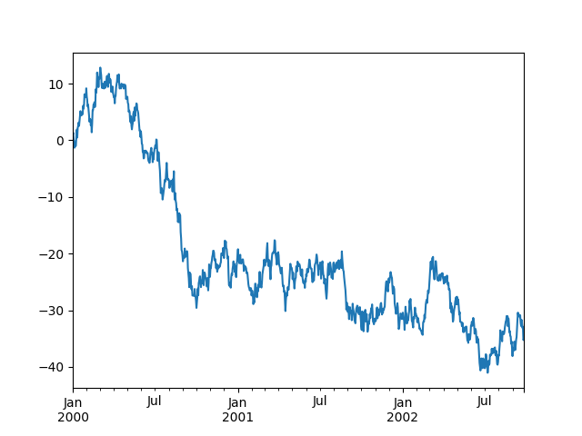
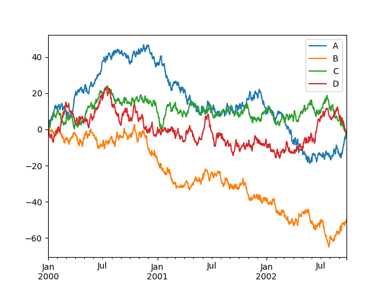

<!-- Quelle: https://raw.githubusercontent.com/pandas-dev/pandas/main/doc/source/user_guide/10min.rst -->

# Pandas in 10 Minuten

Dieses Tutorial ist eine kurze Einführung in [Pandas](https://pandas.pydata.org), welches hauptsächlich für neue Nutzer gedacht ist, die einen Überblick über die Möglichkeiten von Pandas bekommen möchten.

Zum Verständnis sollte man Grundkenntnisse im Umgang mit Python haben. Des Weiteren hilft es, wenn man die Grundlagen von NumPy kennt, besonders was ein NumPy Array ist, da dies hier im Tutorial an einigen Stellen aufgegriffen wird.

*Hinweis*: Dieses Tutorial ist stark an das englischsprachige Tutorial [10 minutes to Pandas](https://pandas.pydata.org/docs/user_guide/10min.html) des Pandas Projekts angelehnt.

## Installation

Pandas lässt sich wie die meisten anderen Python-Module auch, via [pip](https://docs.python.org/3/installing/index.html) installieren:

```shell
pip3 install pandas
```

Wer die Python-Distribution [Anaconda](https://docs.conda.io/en/latest/) nutzt hat Pandas vielleicht schon fertig installiert auf dem System. Ansonsten kann man Pandas dort über den Paketmanager namens conda nachinstallieren:

```shell
conda install pandas
```

Da Pandas im Hintergrund unter anderem auf [NumPy](https://numpy.org) setzt, wird dieses Python-Modul direkt als Abhängigkeit mitinstalliert. NumPy wird im Rahmen dieses Tutorials auch eingesetzt.

## Pandas importieren

Nach erfolgreicher Installation lässt sich Pandas wie folgt installieren:

```python
import pandas as pd
```

Die weit verbreitete Konvention ist, dass `pandas` Modul auf `pd` beim Import umzubenennen. Dies ermöglicht den Zugriff auf Pandas-Funktionen mit einem kurzen, wiedererkennbaren Präfix (`pd.`) und unterscheidet gleichzeitig Pandas-Funktionen von anderen, die eventuell den gleichen Namen tragen.

Das weiter oben bereits erwähnt NumPy wird wie folgt importiert:

```python
import numpy as np
```

## Wie man den Beispielcode liest

In diesem Tutorial und der NumPy Dokumentation findet man immer wieder Codeblöcke wie den folgenden:

```pycon
>>> df = pd.DataFrame(
... {
... "A": 1.0,
... "B": pd.Timestamp("20130102"),
... "C": pd.Series(1, index=list(range(4)), dtype="float32"),
... })
>>> df
     A          B    C
0  1.0 2013-01-02  1.0
1  1.0 2013-01-02  1.0
2  1.0 2013-01-02  1.0
3  1.0 2013-01-02  1.0
```

Text mit vorangestelltem `>>>` oder `...` ist **Eingabe** im interaktiven Python-Interpreter, also der Code, den man in ein Skript oder an einer Python-Eingabeaufforderung eingeben würden. Alles andere ist **Ausgabe**, die Ergebnisse der Ausführung des Codes. Zu beachten ist, dass `>>>` und `...` nicht Teil des Codes sind und einen Fehler verursachen können, wenn sie an einem Python-Prompt eingegeben werden.

## Grundlegenden Datenstrukturen in Pandas

Pandas bietet zwei Typen von Klassen zur Handhabung der Daten:

 1. [Series](https://pandas.pydata.org/docs/reference/api/pandas.Series.html#pandas.Series): ein eindimensionales beschriftetes (indiziertes) Array, das Daten beliebigen Typs enthält, z. B. Ganzzahlen, Zeichenketten, Python-Objekte usw.
 2. [DataFrame](https://pandas.pydata.org/docs/reference/api/pandas.DataFrame.html#pandas.DataFrame): eine zweidimensionale Datenstruktur, die Daten wie ein zweidimensionales Array oder eine Tabelle mit Zeilen und Spalten enthält.

## Objekte anlegen

Weiterführende Informationen zu diesem Thema sind in der Dokumentation im Kapitel [Intro to data structures](https://pandas.pydata.org/docs/user_guide/dsintro.html#dsintro) zu finden.

Das Erstellen einer Series erfolgt z.B. durch Übergabe einer Liste von Werten, wobei Pandas automatisch einen Standard [RangeIndex](https://pandas.pydata.org/docs/reference/api/pandas.RangeIndex.html#pandas.RangeIndex) erstellt.

```pycon
>>> s = pd.Series([1, 3, 5, np.nan, 6, 8])
>>> s
0    1.0
1    3.0
2    5.0
3    NaN
4    6.0
5    8.0
dtype: float64
```

Erstellen eines DataFrame durch Übergabe eines NumPy-Arrays mit einem Datumsindex mittels [date_range](https://pandas.pydata.org/docs/reference/api/pandas.date_range.html#pandas.date_range) und beschrifteten Spalten:

```pycon
>>> dates = pd.date_range("20130101", periods=6)
>>> dates
DatetimeIndex(['2013-01-01', '2013-01-02', '2013-01-03', '2013-01-04',
               '2013-01-05', '2013-01-06'],
              dtype='datetime64[ns]', freq='D')
>>> df = pd.DataFrame(np.random.randn(6, 4), index=dates, columns=list("ABCD"))
>>> df
                   A         B         C         D
2013-01-01  0.469112 -0.282863 -1.509059 -1.135632
2013-01-02  1.212112 -0.173215  0.119209 -1.044236
2013-01-03 -0.861849 -2.104569 -0.494929  1.071804
2013-01-04  0.721555 -0.706771 -1.039575  0.271860
2013-01-05 -0.424972  0.567020  0.276232 -1.087401
2013-01-06 -0.673690  0.113648 -1.478427  0.524988
```

Erstellen eines DataFrame durch Übergabe eines Wörterbuchs von Objekten, wobei die Schlüssel die Spaltenbezeichnungen und die Werte die Spaltenwerte sind.

```pycon
>>> df2 = pd.DataFrame(
...    {"A": 1.0,
...     "B": pd.Timestamp("20130102"),
...     "C": pd.Series(1, index=list(range(4)), dtype="float32"),
...     "D": np.array([3] * 4, dtype="int32"),
...     "E": pd.Categorical(["test", "train", "test", "train"]),
...     "F": "foo",
...    })
>>> df2
     A          B    C  D      E    F
0  1.0 2013-01-02  1.0  3   test  foo
1  1.0 2013-01-02  1.0  3  train  foo
2  1.0 2013-01-02  1.0  3   test  foo
3  1.0 2013-01-02  1.0  3  train  foo
```

Die Spalten des resultierenden DataFrame haben unterschiedliche [dtypes](https://pandas.pydata.org/docs/user_guide/basics.html#basics-dtypes):

```pycon
>>> df2.dtypes
A          float64
B    datetime64[s]
C          float32
D            int32
E         category
F           object
dtype: object
```

`dtype` ist die Kurzform für "data type", auf Deutsch: Datentyp.

## Daten anzeigen

Mehr Informationen hierzu siehe [Essentially basics functionality section](https://pandas.pydata.org/docs/user_guide/basics.html#basics ) in der Dokumentation

Mit [DataFrame.head](https://pandas.pydata.org/docs/reference/api/pandas.DataFrame.head.html#pandas.DataFrame.head) und [DataFrame.tail](https://pandas.pydata.org/docs/reference/api/pandas.DataFrame.tail.html#pandas.DataFrame.tail) kann man sich den Kopf bzw. das Ende eines DataFrames anzeigen lassen:

```pycon
>>> df.head()
                   A         B         C         D
2013-01-01  0.469112 -0.282863 -1.509059 -1.135632
2013-01-02  1.212112 -0.173215  0.119209 -1.044236
2013-01-03 -0.861849 -2.104569 -0.494929  1.071804
2013-01-04  0.721555 -0.706771 -1.039575  0.271860
2013-01-05 -0.424972  0.567020  0.276232 -1.087401
>>> df.tail(3)
                   A         B         C         D
2013-01-04  0.721555 -0.706771 -1.039575  0.271860
2013-01-05 -0.424972  0.567020  0.276232 -1.087401
2013-01-06 -0.673690  0.113648 -1.478427  0.524988
```
[DataFrame.index](https://pandas.pydata.org/docs/reference/api/pandas.DataFrame.index.html#pandas.DataFrame.index) dient zum Anzeigen des Index eines DataFrames, [DataFrame.columns](https://pandas.pydata.org/docs/reference/api/pandas.DataFrame.columns.html#pandas.DataFrame.columns) zeigt die Spaltennamen an:

```pycon
>>> df.index
DatetimeIndex(['2013-01-01', '2013-01-02', '2013-01-03', '2013-01-04',
               '2013-01-05', '2013-01-06'],
              dtype='datetime64[ns]', freq='D')
>>> df.columns
Index(['A', 'B', 'C', 'D'], dtype='object')
```

Rückgabe einer NumPy-Darstellung der zugrundeliegenden Daten mit `DataFrame.to_numpy` ohne den Index oder die Spaltenbeschriftungen:

```pycon
>>> df.to_numpy()
array([[ 0.4691, -0.2829, -1.5091, -1.1356],
       [ 1.2121, -0.1732,  0.1192, -1.0442],
       [-0.8618, -2.1046, -0.4949,  1.0718],
       [ 0.7216, -0.7068, -1.0396,  0.2719],
       [-0.425 ,  0.567 ,  0.2762, -1.0874],
       [-0.6737,  0.1136, -1.4784,  0.525 ]])
```

*Hinweis*: NumPy-Arrays haben einen dtype für das gesamte Array, während Pandas DataFrames einen dtype pro Spalte haben. Wenn man `DataFrame.to_numpy` aufruft, findet Pandas den NumPy dtype, der *alle* dtypes im DataFrame abbilden kann. Wenn der gemeinsame Datentyp `Objekt` ist, erfordert `DataFrame.to_numpy` das Kopieren von Daten.

```pycon
>>> df2.dtypes
A          float64
B    datetime64[s]
C          float32
D            int32
E         category
F           object
dtype: object
>>> df2.to_numpy()
array([[1.0, Timestamp('2013-01-02 00:00:00'), 1.0, 3, 'test', 'foo'],
       [1.0, Timestamp('2013-01-02 00:00:00'), 1.0, 3, 'train', 'foo'],
       [1.0, Timestamp('2013-01-02 00:00:00'), 1.0, 3, 'test', 'foo'],
       [1.0, Timestamp('2013-01-02 00:00:00'), 1.0, 3, 'train', 'foo']],
      dtype=object)
```

[DataFrame.describe](https://pandas.pydata.org/docs/reference/api/pandas.DataFrame.describe.html#pandas.DataFrame.describe) zeigt eine kompakte statistische Zusammenfassung der Daten:

```pycon
>>> df.describe()
             A         B         C         D
count  6.000000  6.000000  6.000000  6.000000
mean   0.073711 -0.431125 -0.687758 -0.233103
std    0.843157  0.922818  0.779887  0.973118
min   -0.861849 -2.104569 -1.509059 -1.135632
25%   -0.611510 -0.600794 -1.368714 -1.076610
50%    0.022070 -0.228039 -0.767252 -0.386188
75%    0.658444  0.041933 -0.034326  0.461706
max    1.212112  0.567020  0.276232  1.071804
```

Das Transponieren funktioniert wie folgt:

```pycon
>>> df.T
2013-01-01  2013-01-02  2013-01-03  2013-01-04  2013-01-05  2013-01-06
A    0.469112    1.212112   -0.861849    0.721555   -0.424972   -0.673690
B   -0.282863   -0.173215   -2.104569   -0.706771    0.567020    0.113648
C   -1.509059    0.119209   -0.494929   -1.039575    0.276232   -1.478427
D   -1.135632   -1.044236    1.071804    0.271860   -1.087401    0.524988
```

[DataFrame.sort_index](https://pandas.pydata.org/docs/reference/api/pandas.DataFrame.sort_index.html#pandas.DataFrame.sort_index) sortiert entlang einer Achse:

```pycon
>>> df.sort_index(axis=1, ascending=False)
                   D         C         B         A
2013-01-01 -1.135632 -1.509059 -0.282863  0.469112
2013-01-02 -1.044236  0.119209 -0.173215  1.212112
2013-01-03  1.071804 -0.494929 -2.104569 -0.861849
2013-01-04  0.271860 -1.039575 -0.706771  0.721555
2013-01-05 -1.087401  0.276232  0.567020 -0.424972
2013-01-06  0.524988 -1.478427  0.113648 -0.673690
```

[DataFrame.sort_values](https://pandas.pydata.org/docs/reference/api/pandas.DataFrame.sort_values.html#pandas.DataFrame.sort_values) sortiert die Werte einer Spalte:

```pycon
>>> df.sort_values(by="B")
                   A         B         C         D
2013-01-03 -0.861849 -2.104569 -0.494929  1.071804
2013-01-04  0.721555 -0.706771 -1.039575  0.271860
2013-01-01  0.469112 -0.282863 -1.509059 -1.135632
2013-01-02  1.212112 -0.173215  0.119209 -1.044236
2013-01-06 -0.673690  0.113648 -1.478427  0.524988
2013-01-05 -0.424972  0.567020  0.276232 -1.087401
```

## Daten auswählen

*Hinweis*: Während Standard-Python- / NumPy-Ausdrücke für das Auswählen und Setzen intuitiv sind und für die interaktive Arbeit nützlich sind, empfehlen die Entwickler von Pandas für Produktionscode die optimierten Pandas-Datenzugriffsmethoden [DataFrame.at](https://pandas.pydata.org/docs/reference/api/pandas.DataFrame.at.html#pandas.DataFrame.at), [DataFrame.iat](https://pandas.pydata.org/docs/reference/api/pandas.DataFrame.iat.html#pandas.DataFrame.iat),  [DataFrame.loc](https://pandas.pydata.org/docs/reference/api/pandas.DataFrame.loc.html#pandas.DataFrame.loc) und  [DataFrame.iloc](https://pandas.pydata.org/docs/reference/api/pandas.DataFrame.iloc.html#pandas.DataFrame.iloc).

Weitere Informationen sind in der Dokumentation unter [Indexing and Selecting Data](https://pandas.pydata.org/docs/user_guide/indexing.html#indexing) und [MultiIndex / Advacned Indexing](https://pandas.pydata.org/docs/user_guide/advanced.html#advanced) zu finden.

### Auf ein Element zugreifen ([])

Bei einem DataFrame wird durch die Übergabe eines einzelnen Labels eine Spalte ausgewählt und eine Series zurückgegeben:

```pycon
>>> df["A"]
2013-01-01    0.469112
2013-01-02    1.212112
2013-01-03   -0.861849
2013-01-04    0.721555
2013-01-05   -0.424972
2013-01-06   -0.673690
Freq: D, Name: A, dtype: float64
```

Bei einem DataFrame werden durch die Übergabe eines Slice `:` die passenden Zeilen ausgewählt:

```pycon
>>> df[0:3]
                   A         B         C         D
2013-01-01  0.469112 -0.282863 -1.509059 -1.135632
2013-01-02  1.212112 -0.173215  0.119209 -1.044236
2013-01-03 -0.861849 -2.104569 -0.494929  1.071804
>>> df["20130102":"20130104"]
                   A         B         C         D
2013-01-02  1.212112 -0.173215  0.119209 -1.044236
2013-01-03 -0.861849 -2.104569 -0.494929  1.071804
2013-01-04  0.721555 -0.706771 -1.039575  0.271860
```

### Auswahl nach Label

Weiterführende Informationen zu `DataFrame.loc` und `DataFrame.at` sind in der Doku unter [Selection by Label](https://pandas.pydata.org/docs/user_guide/indexing.html#indexing-label)

Auswahl einer Zeile basierend auf ihrer Bezeichnung / ihres Indexes:

```pycon
>>> df.loc[dates[0]]
A    0.469112
B   -0.282863
C   -1.509059
D   -1.135632
Name: 2013-01-01 00:00:00, dtype: float64
```

Alle Zeilen für bestimmte Spalten auswählen:

```pycon
>>> df.loc[:, ["A", "B"]]
                   A         B
2013-01-01  0.469112 -0.282863
2013-01-02  1.212112 -0.173215
2013-01-03 -0.861849 -2.104569
2013-01-04  0.721555 -0.706771
2013-01-05 -0.424972  0.567020
2013-01-06 -0.673690  0.113648
```

Bei Pandas sind die Endpunkte - im Gegensatz zum Slicing in Python - immer enthalten:

```pycon
>>> df.loc["20130102":"20130104", ["A", "B"]]
                  A         B
2013-01-02  1.212112 -0.173215
2013-01-03 -0.861849 -2.104569
2013-01-04  0.721555 -0.706771
```

Wenn man eine Zeile und eine Spalte auswählt erhält man einen einzelnen Wert (=ein Skalar) zurück:

```pycon
>>> df.loc[dates[0], "A"]
0.4691122999071863
```

Für den schnellen Zugriff gibt es die folgende, zum vorherigen Beispiel äquivalente, Methode:

```pycon
>>> df.at[dates[0], "A"]
0.4691122999071863
```

### Auswahl nach Position

Weiterführende Information zu `DataFrame.iloc` und `DataFrame.iat` sind in der Dokumentation unter [Selection by Position](https://pandas.pydata.org/docs/user_guide/indexing.html#indexing-integer) zu finden.

Auswahl einer Zeile über deren Index:

```pycon
>>> df.iloc[3]
A    0.721555
B   -0.706771
C   -1.039575
D    0.271860
Name: 2013-01-04 00:00:00, dtype: float64
```

Slicing funktioniert genauso wie bei NumPy und Python:

```pycon
>>> df.iloc[3:5, 0:2]
                   A         B
2013-01-04  0.721555 -0.706771
2013-01-05 -0.424972  0.567020
```

Auswahl von Zeilen und Spalten über übergebene Listen:

```pycon
df.iloc[[1, 2, 4], [0, 2]]
                   A         C
2013-01-02  1.212112  0.119209
2013-01-03 -0.861849 -0.494929
2013-01-05 -0.424972  0.276232
```

Slicing gezielt auf Zeilen anwenden:

```pycon
>>> df.iloc[1:3, :]
                   A         B         C         D
2013-01-02  1.212112 -0.173215  0.119209 -1.044236
2013-01-03 -0.861849 -2.104569 -0.494929  1.071804
```

Slicing gezielt auf Spalten anwenden:

```pycon
>>> df.iloc[:, 1:3]
                   B         C
2013-01-01 -0.282863 -1.509059
2013-01-02 -0.173215  0.119209
2013-01-03 -2.104569 -0.494929
2013-01-04 -0.706771 -1.039575
2013-01-05  0.567020  0.276232
2013-01-06  0.113648 -1.478427
```

Gezielt einen Wert abfragen:

```pycon
>>> df.iloc[1, 1]
-0.17321464905330858
```

Äquivalent zum vorherigen Beispiel für den schnellen Zugriff auf Skalare:

```pycon
>>> df.iat[1, 1]
-0.17321464905330858
```

### Auswahl über (Boolsche) Vergleiche

Alle Zeilen auswählen, in den `df.A` größer als 0 ist:

```pycon
>>> df[df["A"] > 0]
                   A         B         C         D
2013-01-01  0.469112 -0.282863 -1.509059 -1.135632
2013-01-02  1.212112 -0.173215  0.119209 -1.044236
2013-01-04  0.721555 -0.706771 -1.039575  0.271860
```

Auswahl von Werten, die ein vorgegebenes Vergleichskriterium erfüllen, d.h. der Vergleich ist wahr:

```pycon
df[df > 0]
                   A         B         C         D
2013-01-01  0.469112       NaN       NaN       NaN
2013-01-02  1.212112       NaN  0.119209       NaN
2013-01-03       NaN       NaN       NaN  1.071804
2013-01-04  0.721555       NaN       NaN  0.271860
2013-01-05       NaN  0.567020  0.276232       NaN
2013-01-06       NaN  0.113648       NaN  0.524988
```

Auswahl über die [isin](https://pandas.pydata.org/docs/reference/api/pandas.Series.isin.html#pandas.Series.isin) Methode:


```pycon
>>> df2 = df.copy()
>>> df2["E"] = ["one", "one", "two", "three", "four", "three"]
>>> df2
                   A         B         C         D      E
2013-01-01  0.469112 -0.282863 -1.509059 -1.135632    one
2013-01-02  1.212112 -0.173215  0.119209 -1.044236    one
2013-01-03 -0.861849 -2.104569 -0.494929  1.071804    two
2013-01-04  0.721555 -0.706771 -1.039575  0.271860  three
2013-01-05 -0.424972  0.567020  0.276232 -1.087401   four
2013-01-06 -0.673690  0.113648 -1.478427  0.524988  three
>>> df2[df2["E"].isin(["two", "four"])]
                   A         B         C         D     E
2013-01-03 -0.861849 -2.104569 -0.494929  1.071804   two
2013-01-05 -0.424972  0.567020  0.276232 -1.087401  four
```

### Werte setzen

Durch das Anlegen einer neuen Spalte werden die Daten automatisch an den Indizes ausgerichtet:

```pycon
>>> s1 = pd.Series([1, 2, 3, 4, 5, 6], index=pd.date_range("20130102", periods=6))
>>> s1
2013-01-02    1
2013-01-03    2
2013-01-04    3
2013-01-05    4
2013-01-06    5
2013-01-07    6
Freq: D, dtype: int64
>>> df["F"] = s1
```

Werte für ein Label setzen:

```pycon
>>> df.at[dates[0], "A"] = 0
```

Werte für eine Position setzen:

```pycon
>>> df.iat[0, 1] = 0
```

Werte setzen, indem man einen NumPy Array zuweist:

```pycon
>>> df.loc[:, "D"] = np.array([5] * len(df))
```

Das Ergebnis der vorangegangenen Operationen ist wie folgt:

```pycon
>>> df
                   A         B         C    D    F
2013-01-01  0.000000  0.000000 -1.509059  5.0  NaN
2013-01-02  1.212112 -0.173215  0.119209  5.0  1.0
2013-01-03 -0.861849 -2.104569 -0.494929  5.0  2.0
2013-01-04  0.721555 -0.706771 -1.039575  5.0  3.0
2013-01-05 -0.424972  0.567020  0.276232  5.0  4.0
2013-01-06 -0.673690  0.113648 -1.478427  5.0  5.0
```

Werte über eine `where` Operation (Vergleichsoperation) setzen:

```pycon
>>> df2 = df.copy()
>>> df2[df2 > 0] = -df2
>>> df2
                   A         B         C    D    F
2013-01-01  0.000000  0.000000 -1.509059 -5.0  NaN
2013-01-02 -1.212112 -0.173215 -0.119209 -5.0 -1.0
2013-01-03 -0.861849 -2.104569 -0.494929 -5.0 -2.0
2013-01-04 -0.721555 -0.706771 -1.039575 -5.0 -3.0
2013-01-05 -0.424972 -0.567020 -0.276232 -5.0 -4.0
2013-01-06 -0.673690 -0.113648 -1.478427 -5.0 -5.0
```

## Fehlende Daten

Der NumPy Datentype `np.nan` repräsentiert fehlende Daten. Diese werden standardmäßig bei Berechnungen nicht berücksichtigt. Weitere Informationen sind in der Dokumentation im Kapitel [Working with Missing Data](https://pandas.pydata.org/docs/user_guide/missing_data.html#missing-data) zu finden.

Mit der Neuindizierung kann man den Index für eine bestimmte Achse ändern/hinzufügen/löschen. Dabei wird eine Kopie der Daten zurückgegeben:

```pycon
>>> df1 = df.reindex(index=dates[0:4], columns=list(df.columns) + ["E"])
>>> df1.loc[dates[0] : dates[1], "E"] = 1
>>> df1
                   A         B         C    D    F    E
2013-01-01  0.000000  0.000000 -1.509059  5.0  NaN  1.0
2013-01-02  1.212112 -0.173215  0.119209  5.0  1.0  1.0
2013-01-03 -0.861849 -2.104569 -0.494929  5.0  2.0  NaN
2013-01-04  0.721555 -0.706771 -1.039575  5.0  3.0  NaN
```

[DataFrame.dropna](https://pandas.pydata.org/docs/reference/api/pandas.DataFrame.dropna.html#pandas.DataFrame.dropna) entfernt alle Zeilen, in denen Daten fehlen:

```pycon
>>> df1.dropna(how="any")
                   A         B         C    D    F    E
2013-01-02  1.212112 -0.173215  0.119209  5.0  1.0  1.0
```

[DataFrame.fillna](https://pandas.pydata.org/docs/reference/api/pandas.DataFrame.fillna.html#pandas.DataFrame.fillna) füllt Stellen, wo Werte fehlen:

```pycon
>>> df1.fillna(value=5)
                   A         B         C    D    F    E
2013-01-01  0.000000  0.000000 -1.509059  5.0  5.0  1.0
2013-01-02  1.212112 -0.173215  0.119209  5.0  1.0  1.0
2013-01-03 -0.861849 -2.104569 -0.494929  5.0  2.0  5.0
2013-01-04  0.721555 -0.706771 -1.039575  5.0  3.0  5.0
```

[isna](https://pandas.pydata.org/docs/reference/api/pandas.isna.html#pandas.isna) erstellt eine boolsche Maske für Werte, die `nan` sind:

```pycon
>>> pd.isna(df1)
                A      B      C      D      F      E
2013-01-01  False  False  False  False   True  False
2013-01-02  False  False  False  False  False  False
2013-01-03  False  False  False  False  False   True
2013-01-04  False  False  False  False  False   True
```

## Berechnungen und Operation

### Statistik

Bei Berechnungen werden fehlende Daten grundsätzlich ausgeschlossen.

Den Mittelwert für jede Spalte bestimmen:

```pycon
>>> df.mean()
A   -0.004474
B   -0.383981
C   -0.687758
D    5.000000
F    3.000000
dtype: float64
```

Den Mittelwert für jede Zeile bestimmen:

```pycon
>>> df.mean(axis=1)
2013-01-01    0.872735
2013-01-02    1.431621
2013-01-03    0.707731
2013-01-04    1.395042
2013-01-05    1.883656
2013-01-06    1.592306
Freq: D, dtype: float64
```

Wird mit einer anderen `Series` oder `DataFrame` mit einem anderen Index oder einer anderen Spalte gearbeitet, wird das Ergebnis an der Vereinigung der Index- oder Spaltenbeschriftungen ausgerichtet. Darüber hinaus sendet Pandas automatisch entlang der angegebenen Dimension und füllt nicht ausgerichtete Beschriftungen mit `np.nan`.

```pycon
>>> s = pd.Series([1, 3, 5, np.nan, 6, 8], index=dates).shift(2)
>>> s
2013-01-01    NaN
2013-01-02    NaN
2013-01-03    1.0
2013-01-04    3.0
2013-01-05    5.0
2013-01-06    NaN
Freq: D, dtype: float64
>>> df.sub(s, axis="index")
                   A         B         C    D    F
2013-01-01       NaN       NaN       NaN  NaN  NaN
2013-01-02       NaN       NaN       NaN  NaN  NaN
2013-01-03 -1.861849 -3.104569 -1.494929  4.0  1.0
2013-01-04 -2.278445 -3.706771 -4.039575  2.0  0.0
2013-01-05 -5.424972 -4.432980 -4.723768  0.0 -1.0
2013-01-06       NaN       NaN       NaN  NaN  NaN
```

### Benutzerdefinierte Funktionen

[DataFrame.agg](https://pandas.pydata.org/docs/reference/api/pandas.DataFrame.agg.html#pandas.DataFrame.agg) und [DataFrame.transfor](https://pandas.pydata.org/docs/reference/api/pandas.DataFrame.transform.html#pandas.DataFrame.transform) wenden benutzerdefinierte Funktionen an, die ihr Ergebnis reduziert bzw. per Broadcasting mitteilt:

```pycon
>>> df.agg(lambda x: np.mean(x) * 5.6)
A    -0.025054
B    -2.150294
C    -3.851445
D    28.000000
F    16.800000
dtype: float64
>>> df.transform(lambda x: x * 101.2)
                     A           B           C      D      F
2013-01-01    0.000000    0.000000 -152.716721  506.0    NaN
2013-01-02  122.665737  -17.529322   12.063922  506.0  101.2
2013-01-03  -87.219115 -212.982405  -50.086843  506.0  202.4
2013-01-04   73.021382  -71.525239 -105.204988  506.0  303.6
2013-01-05  -43.007200   57.382459   27.954680  506.0  404.8
2013-01-06  -68.177398   11.501219 -149.616767  506.0  506.0
```

### Werte zählen

Weitere Informationen sind auch in der Dokumentation unter [Value counts (histogramming) / mode](https://pandas.pydata.org/docs/user_guide/basics.html#basics-discretization) zu finden.

```pycon
>>> s = pd.Series(np.random.randint(0, 7, size=10))
>>> s
0    4
1    2
2    1
3    2
4    6
5    4
6    4
7    6
8    4
9    4
dtype: int64
>>> s.value_counts()
4    5
2    2
6    2
1    1
Name: count, dtype: int64
```

### String Methoden

`Series` ist mit einer Reihe von String-Verarbeitungsmethoden im `str`-Attribut ausgestattet, die es einfach machen, mit jedem Element des Arrays zu arbeiten, wie im folgenden Codeschnipsel gezeigt. Mehr dazu findet man in der Dokumentation im Kapitel [String Methods](https://pandas.pydata.org/docs/user_guide/text.html#text-string-methods).

```pycon
>>> s = pd.Series(["A", "B", "C", "Aaba", "Baca", np.nan, "CABA", "dog", "cat"])
>>> s.str.lower()
0       a
1       b
2       c
3    aaba
4    baca
5    <NA>
6    caba
7     dog
8     cat
dtype: string
>>> s.str.upper()
0       A
1       B
2       C
3    AABA
4    BACA
5    <NA>
6    CABA
7     DOG
8     CAT
dtype: string
```

## Daten zusammenführen

### Verkettung

Pandas bietet verschiedene Möglichkeiten zur einfachen Verkettung von `Series` und `DataFrame` Objekten mit verschiedenen Arten von Mengenlogik für die Indizes und relationaler Algebra-Funktionalität im Falle von join / merge-artigen Operationen. Weitere Informationen sind auch in der Dokumentation unter [Merge, join, concatenate and compare](https://pandas.pydata.org/docs/user_guide/merging.html#merging) zu finden.

```pycon
>>> df = pd.DataFrame(np.random.randn(10, 4))
>>> df
          0         1         2         3
0 -0.548702  1.467327 -1.015962 -0.483075
1  1.637550 -1.217659 -0.291519 -1.745505
2 -0.263952  0.991460 -0.919069  0.266046
3 -0.709661  1.669052  1.037882 -1.705775
4 -0.919854 -0.042379  1.247642 -0.009920
5  0.290213  0.495767  0.362949  1.548106
6 -1.131345 -0.089329  0.337863 -0.945867
7 -0.932132  1.956030  0.017587 -0.016692
8 -0.575247  0.254161 -1.143704  0.215897
9  1.193555 -0.077118 -0.408530 -0.862495
>>> # in drei Teile aufteilen
>>> pieces = [df[:3], df[3:7], df[7:]]
>>> pd.concat(pieces)
          0         1         2         3
0 -0.548702  1.467327 -1.015962 -0.483075
1  1.637550 -1.217659 -0.291519 -1.745505
2 -0.263952  0.991460 -0.919069  0.266046
3 -0.709661  1.669052  1.037882 -1.705775
4 -0.919854 -0.042379  1.247642 -0.009920
5  0.290213  0.495767  0.362949  1.548106
6 -1.131345 -0.089329  0.337863 -0.945867
7 -0.932132  1.956030  0.017587 -0.016692
8 -0.575247  0.254161 -1.143704  0.215897
9  1.193555 -0.077118 -0.408530 -0.862495
```

*Hinweis*: Das Hinzufügen einer Spalte zu einem `DataFrame` ist relativ schnell. Das Hinzufügen einer Zeile erfordert jedoch eine Kopie und kann teuer in Bezug auf die Ausführungsgeschwindigkeit sein. Es wird empfohlen, eine vorgefertigte Liste von Datensätzen an den `DataFrame`-Konstruktor zu übergeben, anstatt einen `DataFrame` durch iteratives Hinzufügen von Datensätzen zu erstellen.

### Zusammenführen

[merge](https://pandas.pydata.org/docs/reference/api/pandas.merge.html#pandas.merge) erlaubt join-Operation, wie an sie von SQL kennt, für die spezifizierten Spalten. Weitere Informationen sind in der Dokumentation unter [Database style joining](https://pandas.pydata.org/docs/user_guide/merging.html#merging-join) zu finden.

```pycon
>>> left = pd.DataFrame({"key": ["foo", "foo"], "lval": [1, 2]})
>>> right = pd.DataFrame({"key": ["foo", "foo"], "rval": [4, 5]})
>>> left
   key  lval
0  foo     1
1  foo     2
>>> right
   key  rval
0  foo     4
1  foo     5
>>> pd.merge(left, right, on="key")
Out[81]:
   key  lval  rval
0  foo     1     4
1  foo     1     5
2  foo     2     4
3  foo     2     5
   right
```

`merge` für einmalige Schlüssel:

```pycon
>>> left = pd.DataFrame({"key": ["foo", "bar"], "lval": [1, 2]})
>>> right = pd.DataFrame({"key": ["foo", "bar"], "rval": [4, 5]})
>>> left
   key  lval
0  foo     1
1  bar     2
>>> right
Out[85]:
   key  rval
0  foo     4
1  bar     5
>>> pd.merge(left, right, on="key")
Out[86]:
   key  lval  rval
0  foo     1     4
1  bar     2     5
```

### Gruppieren

Mit "group by" ist ein Prozess gemeint, der einen oder mehrere der folgenden Schritte umfasst:

 * *Aufteilung* der Daten in Gruppen nach bestimmten Kriterien
 * *Anwenden* einer Funktion auf jede Gruppe unabhängig
 * *Zusammenfassen* der Ergebnisse in einer Datenstruktur

Weitere Informationen sind in der Dokumentation im Kapitel [Group by: split-apply-combine](https://pandas.pydata.org/docs/user_guide/groupby.html#groupby) zu finden.


```pycon
>>> df = pd.DataFrame(
...     {
...      "A": ["foo", "bar", "foo", "bar", "foo", "bar", "foo", "foo"],
...      "B": ["one", "one", "two", "three", "two", "two", "one", "three"],
...      "C": np.random.randn(8),
...      "D": np.random.randn(8),
...     })
>>> df
     A      B         C         D
0  foo    one  1.346061 -1.577585
1  bar    one  1.511763  0.396823
2  foo    two  1.627081 -0.105381
3  bar  three -0.990582 -0.532532
4  foo    two -0.441652  1.453749
5  bar    two  1.211526  1.208843
6  foo    one  0.268520 -0.080952
7  foo  three  0.024580 -0.264610
```

Gruppierung nach einer Spaltenbeschriftung, Auswahl von Spaltenbeschriftungen und anschließende Anwendung der Funktion `DataFrameGroupBy.sum` auf die resultierenden Gruppen:

```pycon
>>> df.groupby("A")[["C", "D"]].sum()
            C         D
A
bar  1.732707  1.073134
foo  2.824590 -0.574779
```

Die Gruppierung nach mehreren Spaltenlabeln bildet einen [MultiIndex](https://pandas.pydata.org/docs/reference/api/pandas.MultiIndex.html#pandas.MultiIndex).

```pycon
>>> df.groupby(["A", "B"]).sum()
                  C         D
A   B
bar one    1.511763  0.396823
    three -0.990582 -0.532532
    two    1.211526  1.208843
foo one    1.614581 -1.658537
    three  0.024580 -0.264610
    two    1.185429  1.348368
```

## Reshaping

Weitere Informationen findet man in der Dokumentation unter [Hierarchical indexing (MultiIndex)](https://pandas.pydata.org/docs/user_guide/advanced.html#advanced-hierarchical) und [Reshaping and pivot tables](https://pandas.pydata.org/docs/user_guide/reshaping.html).

### Stacking

```pycon
>>> arrays = [
... ["bar", "bar", "baz", "baz", "foo", "foo", "qux", "qux"],
... ["one", "two", "one", "two", "one", "two", "one", "two"],
... ]
>>> index = pd.MultiIndex.from_arrays(arrays, names=["first", "second"])
>>> df = pd.DataFrame(np.random.randn(8, 2), index=index, columns=["A", "B"])
>>> df2 = df[:4]
>>> df2
                     A         B
first second
bar   one    -0.727965 -0.589346
      two     0.339969 -0.693205
baz   one    -0.339355  0.593616
      two     0.884345  1.591431
```

Die [stack](https://pandas.pydata.org/docs/reference/api/pandas.DataFrame.stack.html#pandas.DataFrame.stack) Methode von DataFrames "komprimiert" in den Spalten des DataFrames:

```pycon
>>> stacked = df2.stack(future_stack=True)
>>> stacked
first  second
bar    one     A   -0.727965
               B   -0.589346
       two     A    0.339969
               B   -0.693205
baz    one     A   -0.339355
               B    0.593616
       two     A    0.884345
               B    1.591431
dtype: float64
```

Bei einem "gestapelten" DataFrame oder einer Serie (mit einem `MultiIndex` als `Index`) ist die umgekehrte Operation von `stack` [unstack](https://pandas.pydata.org/docs/reference/api/pandas.DataFrame.unstack.html#pandas.DataFrame.unstack), die standardmäßig die letzte Ebene entstapelt:

```pycon
>>> stacked.unstack()
                     A         B
first second
bar   one    -0.727965 -0.589346
      two     0.339969 -0.693205
baz   one    -0.339355  0.593616
      two     0.884345  1.591431
>>> stacked.unstack(1)
second        one       two
first
bar   A -0.727965  0.339969
      B -0.589346 -0.693205
baz   A -0.339355  0.884345
      B  0.593616  1.591431
>>> stacked.unstack(0)
first          bar       baz
second
one    A -0.727965 -0.339355
       B -0.589346  0.593616
two    A  0.339969  0.884345
       B -0.693205  1.591431
   stacked.unstack(1)
   stacked.unstack(0)
```

### Pivot Tabellen

Mehr Informationen findet man in der Dokumentation im Kapitel [Pivot Tables](https://pandas.pydata.org/docs/user_guide/reshaping.html#reshaping-pivot).

```pycon
>>> df = pd.DataFrame(
... {
...  "A": ["one", "one", "two", "three"] * 3,
...  "B": ["A", "B", "C"] * 4,
...  "C": ["foo", "foo", "foo", "bar", "bar", "bar"] * 2,
...  "D": np.random.randn(12),
...  "E": np.random.randn(12),
..   })
>>> df
        A  B    C         D         E
0     one  A  foo -1.202872  0.047609
1     one  B  foo -1.814470 -0.136473
2     two  C  foo  1.018601 -0.561757
3   three  A  bar -0.595447 -1.623033
4     one  B  bar  1.395433  0.029399
5     one  C  bar -0.392670 -0.542108
6     two  A  foo  0.007207  0.282696
7   three  B  foo  1.928123 -0.087302
8     one  C  foo -0.055224 -1.575170
9     one  A  bar  2.395985  1.771208
10    two  B  bar  1.552825  0.816482
11  three  C  bar  0.166599  1.100230
```

Die [pivot_table](https://pandas.pydata.org/docs/reference/api/pandas.pivot_table.html#pandas.pivot_table) Funktion eines DataFrames pivotiert diesen unter Angabe der Werte, des Index und der Spalten:

```pycon
>>> pd.pivot_table(df, values="D", index=["A", "B"], columns=["C"])
C             bar       foo
A     B
one   A  2.395985 -1.202872
      B  1.395433 -1.814470
      C -0.392670 -0.055224
three A -0.595447       NaN
      B       NaN  1.928123
      C  0.166599       NaN
two   A       NaN  0.007207
      B  1.552825       NaN
      C       NaN  1.018601
```

## Zeitreihen

Pandas verfügt über eine einfache, leistungsstarke und effiziente Funktionalität zur Durchführung von Resampling-Operationen bei der Frequenzkonvertierung (z. B. Konvertierung von sekündlichen Daten in 5-Minuten-Daten). Dies ist sehr häufig in Finanzanwendungen, aber nicht nur dort, der Fall. Weitere Informationen sind in der Dokumentation im Kapitel [Time Series](https://pandas.pydata.org/docs/user_guide/timeseries.html#timeseries) zu finden.

```pycon
>>> rng = pd.date_range("1/1/2012", periods=100, freq="s")
>>> ts = pd.Series(np.random.randint(0, 500, len(rng)), index=rng)
>>> ts.resample("5Min").sum()
2012-01-01    24182
Freq: 5min, dtype: int64
```

[Series.tz_localize](https://pandas.pydata.org/docs/reference/api/pandas.Series.tz_localize.html#pandas.Series.tz_localize) lokalisiert eine Zeitreihe für eine Zeitzone:

```pycon
>>> rng = pd.date_range("3/6/2012 00:00", periods=5, freq="D")
>>> ts = pd.Series(np.random.randn(len(rng)), rng)
>>> ts
012-03-06    1.857704
2012-03-07   -1.193545
2012-03-08    0.677510
2012-03-09   -0.153931
2012-03-10    0.520091
Freq: D, dtype: float64
>>> ts_utc = ts.tz_localize("UTC")
>>> ts_utc
2012-03-06 00:00:00+00:00    1.857704
2012-03-07 00:00:00+00:00   -1.193545
2012-03-08 00:00:00+00:00    0.677510
2012-03-09 00:00:00+00:00   -0.153931
2012-03-10 00:00:00+00:00    0.520091
Freq: D, dtype: float64
```

[Series.tz_convert](https://pandas.pydata.org/docs/reference/api/pandas.Series.tz_convert.html#pandas.Series.tz_convert) konvertiert eine Zeitreihe, die "timezones aware" ist, in eine andere Zeitzone:

```pycon
>>> ts_utc.tz_convert("US/Eastern")
2012-03-05 19:00:00-05:00    1.857704
2012-03-06 19:00:00-05:00   -1.193545
2012-03-07 19:00:00-05:00    0.677510
2012-03-08 19:00:00-05:00   -0.153931
2012-03-09 19:00:00-05:00    0.520091
Freq: D, dtype: float64
```

Hinzufügen einer relativen Zeitdauer mit [BusinessDay](https://pandas.pydata.org/docs/reference/api/pandas.tseries.offsets.BusinessDay.html#pandas.tseries.offsets.BusinessDay) zu einer Zeitreihe:

```pycon
>>> rng
DatetimeIndex(['2012-03-06', '2012-03-07', '2012-03-08', '2012-03-09',
               '2012-03-10'],
              dtype='datetime64[ns]', freq='D')
>>> rng + pd.offsets.BusinessDay(5)
DatetimeIndex(['2012-03-13', '2012-03-14', '2012-03-15', '2012-03-16',
               '2012-03-16'],
              dtype='datetime64[ns]', freq=None)
   rng + pd.offsets.BusinessDay(5)
```

## Kategorien

pandas kann kategorische Daten in einen `DataFrame` aufnehmen. Die vollständige Dokumentation ist in den Kapiteln [Categorial data](https://pandas.pydata.org/docs/user_guide/categorical.html#categorical) und der [API-Dokumentation](https://pandas.pydata.org/docs/reference/arrays.html#api-arrays-categorical) zu finden.

```pycon
>>> df = pd.DataFrame(
...     {"id": [1, 2, 3, 4, 5, 6], "raw_grade": ["a", "b", "b", "a", "a", "e"]}
...     )
```

Umwandlung von `raw_grade` in einen kategorischen Datentyp:

```pycon
>>> df["grade"] = df["raw_grade"].astype("category")
>>> df["grade"]
0    a
1    b
2    b
3    a
4    a
5    e
Name: grade, dtype: category
Categories (3, object): ['a', 'b', 'e']
```

Umbenennen der Kategorien mit besseren / ausdrucksstärkeren Namen:

```pycon
>>> new_categories = ["very good", "good", "very bad"]
>>> df["grade"] = df["grade"].cat.rename_categories(new_categories)
```

Ordnet die Kategorien neu und fügt gleichzeitig die fehlenden Kategorien hinzu. Die Methoden unter [Series.cat](https://pandas.pydata.org/docs/reference/api/pandas.Series.cat.html#pandas.Series.cat) geben standardmäßig eine neue :`Series` zurück:

```pycon
>>> df["grade"] = df["grade"].cat.set_categories(
...     ["very bad", "bad", "medium", "good", "very good"]
...     )
>>> df["grade"]
0    very good
1         good
2         good
3    very good
4    very good
5     very bad
Name: grade, dtype: category
Categories (5, object): ['very bad', 'bad', 'medium', 'good', 'very good']
```

Sortiert wird nach der Reihenfolge der Kategorien, nicht lexigraphisch:

```pycon
>>> df.sort_values(by="grade")
   id raw_grade      grade
5   6         e   very bad
1   2         b       good
2   3         b       good
0   1         a  very good
3   4         a  very good
4   5         a  very good
```

Die Gruppierung nach einer Kategorienspalte mit `observed=False` zeigt auch leere Kategorien:

```pycon
>>> df.groupby("grade", observed=False).size()
grade
very bad     1
bad          0
medium       0
good         2
very good    3
dtype: int64
```

## Plotten

Weitere Informationen sind in der Dokumentation unter [Chart visualization](https://pandas.pydata.org/docs/user_guide/visualization.html#visualization) zu finden.

Es werden die Standardkonventionen zur Nutzung der [matplotlib API](https://matplotlib.org/stable/api/index.html) genutzt:

```pycon
>>> import matplotlib.pyplot as plt
>>> plt.close("all")
```

Die `plt.close` Methode wird zum [Schließen](https://matplotlib.org/stable/api/_as_gen/matplotlib.pyplot.close.html) eines offenen Fensters mit einem Plot genutzt.

```pycon
>>> ts = pd.Series(np.random.randn(1000), index=pd.date_range("1/1/2000", periods=1000))
>>> ts = ts.cumsum()
>>> ts.plot()
<Axes: >
>>> plot.show()
```



Die [plot](https://pandas.pydata.org/docs/reference/api/pandas.DataFrame.plot.html#pandas.DataFrame.plot) Methode eines `DataFrame` plottet alle Spalten:

```pycon
>>> df = pd.DataFrame(
...     np.random.randn(1000, 4), index=ts.index, columns=["A", "B", "C", "D"]
...     )
>>> df = df.cumsum()
>>> plt.figure()
<Figure size 640x480 with 0 Axes>
>>> df.plot()
<Axes: >
>>> plt.legend(loc='best')
<matplotlib.legend.Legend object at 0x0000021E4577A7A0>
>>> plt.show()
```



## Daten Import und Export

Weitere Informationen zu dm Thema sind in der Dokumentation im Kapitel [IO Tools](https://pandas.pydata.org/docs/user_guide/io.html#io) zu finden.

### CSV

Um eine [CSV-Datei zu schreiben](https://pandas.pydata.org/docs/user_guide/io.html#io-store-in-csv) nutzt man die [to_csv](https://pandas.pydata.org/docs/reference/api/pandas.DataFrame.to_csv.html#pandas.DataFrame.to_csv) Methode eines `DataFrame`:

```pycon
>>> df = pd.DataFrame(np.random.randint(0, 5, (10, 5)))
>>> df.to_csv("foo.csv")
```

Um eine [CSV-Datei zu lesen](https://pandas.pydata.org/docs/user_guide/io.html#io-read-csv-table) nutzt man die [read_csv](https://pandas.pydata.org/docs/reference/api/pandas.read_csv.html#pandas.read_csv) Methode von Pandas:

```pycon
>>> pd.read_csv("foo.csv")
   Unnamed: 0  0  1  2  3  4
0           0  4  3  1  1  2
1           1  1  0  2  3  2
2           2  1  4  2  1  2
3           3  0  4  0  2  2
4           4  4  2  2  3  4
5           5  4  0  4  3  1
6           6  2  1  2  0  3
7           7  4  0  4  4  4
8           8  4  4  1  0  1
9           9  0  4  3  0  3
```

### Parquet

Schreiben in einer [Parquet](https://parquet.apache.org/) Datei:

```pycon
>>> df.to_parquet("foo.parquet")
```

Das Lesen einer Parquet-Datei erfolgt mit der [read_parquet](https://pandas.pydata.org/docs/reference/api/pandas.read_parquet.html#pandas.read_parquet) Methode von Pandas:

```pycon
>>> pd.read_parquet("foo.parquet")
   0  1  2  3  4
0  4  3  1  1  2
1  1  0  2  3  2
2  1  4  2  1  2
3  0  4  0  2  2
4  4  2  2  3  4
5  4  0  4  3  1
6  2  1  2  0  3
7  4  0  4  4  4
8  4  4  1  0  1
9  0  4  3  0  3
```

### Excel

Mehr Informationen zum Lesen und Schreiben von Excel-Dateien findet man in der Dokumentation im Kapitel [Excel Files](https://pandas.pydata.org/docs/user_guide/io.html#io-excel).

Um Excel-Daten zu Lesen und zu schreiben, wird ein zusätzliches Modul zum Umgang mit Excel-Dateien benötigt. Pandas unterstützt dafür [verschiedene Module](https://pandas.pydata.org/docs/user_guide/io.html#reading-excel-files), hier wird [openpyxl](https://openpyxl.readthedocs.io/en/stable/) verwendet. Dies kann wiefolgt installiert werden:

```shell
pip3 install openpyxl
```

Zum Schreiben eines Excel-Datei wird die [to_excel](https://pandas.pydata.org/docs/reference/api/pandas.DataFrame.to_excel.html#pandas.DataFrame.to_excel`) Methode eines `DataFrame` genutzt:

```pycon
>>> df.to_excel("foo.xlsx", sheet_name="Sheet1")
```

Zum Einlesen einer Excel-Datei wird die [read_excel](https://pandas.pydata.org/docs/reference/api/pandas.read_excel.html#pandas.read_excel) Methode von Pandas benutzt:

```pycon
>>> pd.read_excel("foo.xlsx", "Sheet1", index_col=None, na_values=["NA"])
   Unnamed: 0  0  1  2  3  4
0           0  4  3  1  1  2
1           1  1  0  2  3  2
2           2  1  4  2  1  2
3           3  0  4  0  2  2
4           4  4  2  2  3  4
5           5  4  0  4  3  1
6           6  2  1  2  0  3
7           7  4  0  4  4  4
8           8  4  4  1  0  1
9           9  0  4  3  0  3
```

## Stolperfallen

Wenn man versucht, eine boolesche Operation mit einer `Series` oder einem `DataFrame` durchzuführen, kann eine Ausnahme wie diese auftreten:

```pycon
>>> if pd.Series([False, True, False]):
...     print("I was true")
...
---------------------------------------------------------------------------
ValueError                                Traceback (most recent call last)
<ipython-input-141-b27eb9c1dfc0> in ?()
----> 1 if pd.Series([False, True, False]):
      2      print("I was true")

~/work/pandas/pandas/pandas/core/generic.py in ?(self)
   1574     @final
   1575     def __nonzero__(self) -> NoReturn:
-> 1576         raise ValueError(
   1577             f"The truth value of a {type(self).__name__} is ambiguous. "
   1578             "Use a.empty, a.bool(), a.item(), a.any() or a.all()."
   1579         )

ValueError: The truth value of a Series is ambiguous. Use a.empty, a.bool(), a.item(), a.any() or a.all().
```

Hinweise zum Beheben des Fehlers findet man in der Dokumentation in den Kapiteln [Flexible Comparisions](https://pandas.pydata.org/docs/user_guide/basics.html#basics-compare) und [Frequently Asked Questions](https://pandas.pydata.org/docs/user_guide/gotchas.html#gotchas).

## nächste Schritte

Dieses Tutorial ist, wie anfangs bereits gesagt, ein sehr kurzer Überblick über Pandas. Pandas ist sehr umfangreich dokumentiert, unter anderem auf den folgenden Seiten:

 * [Cookbook](https://pandas.pydata.org/docs/user_guide/cookbook.html#cookbook): Sammlung von (kurzen) Rezepten / Praxixbeispielen zu Pandas
 * [User Guide](https://pandas.pydata.org/docs/user_guide/index.html): umfangreiche Einführung und Erklärung zu Pandas
 * [API Referenz](https://pandas.pydata.org/docs/reference/index.html)

## Über dieses Tutorial

 * Autor: noisefloor (<nsflr.bnt (at) gmail.com>)
 * Lizenz: [CC0 Universell](https://creativecommons.org/publicdomain/zero/1.0/deed.de)
 * Github Seite: [github.com/noisefloor/depytu](https://github.com/noisefloor/depytu)
